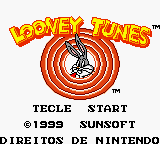
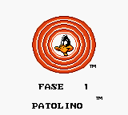
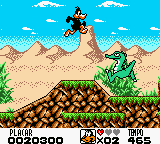

# Looney Tunes

## Informações sobre o jogo

| Tipo | Informação |
| ----------- | ----------- |
| Nome | Looney Tunes |
| Plataforma | [Game Boy Color](../) |
| Desenvolvedora | Sunsoft |
| Distribuidora | Sunsoft |
| Gênero | Ação / Plataforma |
| Data de Lançamento | (Por volta de) ??/??/1999 |

## Informações sobre a tradução

| Tipo | Informação |
| ----------- | ----------- |
| Versão | 1\.0 |
| Última versão | Sim |
| Data de Lançamento | 11/10/2022 |
| Percentual traduzido | None% |

## Autores

| Autor(a) | Papel na tradução |
| ----------- | ----------- |
| [ChocoLixo](../../../autores/chocolixo/) | Completo |

## Informações sobre patching

| Formato do patch | Aplicar o patch no arquivo | CRC32 Hash | MD5 Hash |
| ----------- | ----------- | ----------- | ----------- |
| IPS | Looney Tunes \(U\) \[C\]\[\!\]\.gbc | 4EF3DDD7 | F687B51A0FAB72E03766356B62261A49 |

## Páginas sobre a tradução

| URL | Oficial (publicado pelos autores) | Possuí link de download |
| ----------- | ----------- | ----------- |
| [https://www.romhacking.net/translations/6679/](https://www.romhacking.net/translations/6679/) | Sim | Sim |

## Imagens da tradução

