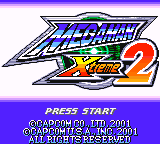
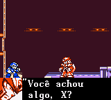

# Mega Man Xtreme 2

## Informações sobre o jogo

| Tipo | Informação |
| ----------- | ----------- |
| Nome | Mega Man Xtreme 2 |
| Plataforma | [Game Boy Color](../) |
| Desenvolvedora | Capcom |
| Distribuidora | Capcom |
| Gênero | Run 'n gun |
| Data de Lançamento | 30/10/2001 |

## Informações sobre a tradução

| Tipo | Informação |
| ----------- | ----------- |
| Versão | 1\.2a |
| Última versão | Sim |
| Data de Lançamento | 19/10/2002 |
| Percentual traduzido | 100% |

## Autores

| Autor(a) | Papel na tradução |
| ----------- | ----------- |
| [Fserve](../../../autores/fserve/) | Completo |
| [R\_Lopes](../../../autores/r_lopes/) | Romhacking |
| [RodrigoX\_Shin](../../../autores/rodrigox_shin/) | Tradução |

## Grupos

* [Tradu\-Roms](../../../grupos/tradu-roms/)

## Informações sobre patching

| Aplicar o patch no arquivo | CRC32 Hash | MD5 Hash |
| ----------- | ----------- | ----------- |
| Mega Man Xtreme 2 \(U\) \[C\]\[\!\]\.gbc | 8FEDB6D8 | 1F64989765F605D05CBD013E7FFCC352 |

## Páginas sobre a tradução

| URL | Oficial (publicado pelos autores) | Possuí link de download |
| ----------- | ----------- | ----------- |
| [https://traduroms.github.io/tr/tradus/mmxt2.htm](https://traduroms.github.io/tr/tradus/mmxt2.htm) | Sim | Sim |
| [https://www.zophar.net/translations/gameboy/portuguese/mega-man-xtreme-2.html](https://www.zophar.net/translations/gameboy/portuguese/mega-man-xtreme-2.html) | Não | Sim |
| [https://www.romhacking.net/translations/1936/](https://www.romhacking.net/translations/1936/) | Não | Sim |
| [https://romhackers.org/traducoes/portatil/game-boy-color/mega-man-xtreme-2-tradu-roms/](https://romhackers.org/traducoes/portatil/game-boy-color/mega-man-xtreme-2-tradu-roms/) | Não | Não |

## Imagens da tradução

