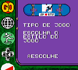
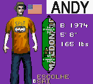
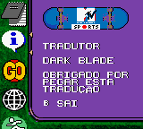
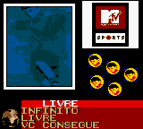
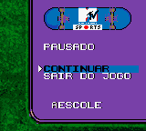
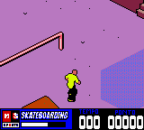

# MTV Sports - Skateboarding featuring Andy Macdonald

## Informações sobre o jogo

| Tipo | Informação |
| ----------- | ----------- |
| Nome | MTV Sports \- Skateboarding featuring Andy Macdonald |
| Plataforma | [Game Boy Color](../) |
| Desenvolvedora | Yellowbelly |
| Distribuidora | THQ |
| Gênero | Esportes |
| Data de Lançamento | 28/08/2000 |

## Informações sobre a tradução

| Tipo | Informação |
| ----------- | ----------- |
| Última versão | Sim |
| Data de Lançamento | (Por volta de) ??/06/2001 |
| Percentual traduzido | 100% |

## Autores

| Autor(a) | Papel na tradução |
| ----------- | ----------- |
| [Dark\_Blade](../../../autores/dark_blade/) | Completo |

## Grupos

* [Evil Darkness](../../../grupos/evil-darkness/)

## Informações sobre patching

| Aplicar o patch no arquivo | CRC32 Hash | MD5 Hash |
| ----------- | ----------- | ----------- |
| MTV Sports \- Skateboarding featuring Andy MacDonald \(U\) \[C\]\[\!\]\.gbc | 744561F3 | 54165D2BF7A040AA31D6D0956408D10D |

## Páginas sobre a tradução

| URL | Oficial (publicado pelos autores) | Possuí link de download |
| ----------- | ----------- | ----------- |
| [https://www.zophar.net/translations/gameboy/brazilian-portuguese/mtv-sports-skateboarding-featuring-andy-macdonald.html](https://www.zophar.net/translations/gameboy/brazilian-portuguese/mtv-sports-skateboarding-featuring-andy-macdonald.html) | Não | Sim |
| [https://romhackers.org/traducoes/portatil/game-boy-color/mtv-sports-skateboarding-featuring-andy-macdonald-evil-darkness/](https://romhackers.org/traducoes/portatil/game-boy-color/mtv-sports-skateboarding-featuring-andy-macdonald-evil-darkness/) | Não | Não |

## Imagens da tradução

