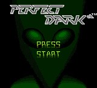
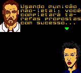
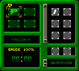

# Perfect Dark

## Informações sobre o jogo

| Tipo | Informação |
| ----------- | ----------- |
| Nome | Perfect Dark |
| Plataforma | [Game Boy Color](../) |
| Desenvolvedora | Rare |
| Distribuidora | Nintendo |
| Gênero | Ação |
| Data de Lançamento | 28/08/2000 |

## Informações sobre a tradução

| Tipo | Informação |
| ----------- | ----------- |
| Versão | 1\.0 |
| Última versão | Sim |
| Data de Lançamento | 13/06/2003 |
| Percentual traduzido | 98% |

## Autores

| Autor(a) | Papel na tradução |
| ----------- | ----------- |
| [Gambas](../../../autores/gambas/) | Completo |
| [Ifrit Ryudo](../../../autores/ifrit-ryudo/) | Completo |
| [Japa Boy Junior](../../../autores/japa-boy-junior/) | Completo |

## Grupos

* [Trans\-Center](../../../grupos/trans-center/)

## Informações sobre patching

| Aplicar o patch no arquivo | CRC32 Hash | MD5 Hash |
| ----------- | ----------- | ----------- |
| Perfect Dark \(U\) \(M5\) \[C\]\[\!\]\.gbc | 0601BEF6 | 840E1DDB2696ECAE487FD264A3C34581 |

## Páginas sobre a tradução

| URL | Oficial (publicado pelos autores) | Possuí link de download |
| ----------- | ----------- | ----------- |
| [https://www.zophar.net/translations/gameboy/brazilian-portuguese/perfect-dark.html](https://www.zophar.net/translations/gameboy/brazilian-portuguese/perfect-dark.html) | Não | Sim |
| [https://romhackers.org/traducoes/portatil/game-boy-color/perfect-dark-trans-center/](https://romhackers.org/traducoes/portatil/game-boy-color/perfect-dark-trans-center/) | Não | Não |

## Imagens da tradução

