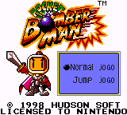
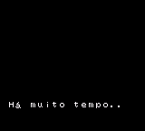
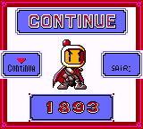

# Pocket Bomberman

## Informações sobre o jogo

| Tipo | Informação |
| ----------- | ----------- |
| Nome | Pocket Bomberman |
| Plataforma | [Game Boy Color](../) |
| Desenvolvedora | Hudson |
| Distribuidora | Nintendo |
| Gênero | Estratégia |
| Data de Lançamento | (Por volta de) ??/??/1998 |

## Informações sobre a tradução

| Tipo | Informação |
| ----------- | ----------- |
| Última versão | Sim |
| Data de Lançamento | 02/06/2001 |
| Percentual traduzido | 100% |

## Autores

| Autor(a) | Papel na tradução |
| ----------- | ----------- |
| [Shadow\-Kn](../../../autores/shadow-kn/) | Completo |

## Grupos

* [Tradu\-Roms](../../../grupos/tradu-roms/)

## Informações sobre patching

| Aplicar o patch no arquivo | CRC32 Hash | MD5 Hash |
| ----------- | ----------- | ----------- |
| Pocket Bomberman \(U\) \[C\]\[\!\]\.gbc | FA2A66E9 | 2F6B6379F8C7CE5D66A198162F345EAA |

## Páginas sobre a tradução

| URL | Oficial (publicado pelos autores) | Possuí link de download |
| ----------- | ----------- | ----------- |
| [https://www.zophar.net/translations/gameboy/brazilian-portuguese/pocket-bomberman.html](https://www.zophar.net/translations/gameboy/brazilian-portuguese/pocket-bomberman.html) | Não | Sim |
| [https://romhackers.org/traducoes/portatil/game-boy-color/pocket-bomberman-tradu-roms/](https://romhackers.org/traducoes/portatil/game-boy-color/pocket-bomberman-tradu-roms/) | Não | Não |

## Imagens da tradução

