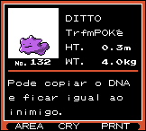
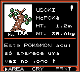
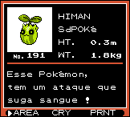
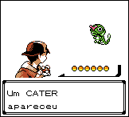

# Pocket Monsters Kin

## Informações sobre o jogo

| Tipo | Informação |
| ----------- | ----------- |
| Nome | Pocket Monsters Kin |
| Plataforma | [Game Boy Color](../) |
| Desenvolvedora | Game Freak |
| Distribuidora | Nintendo |
| Gênero | RPG |
| Data de Lançamento | 21/11/1999 |

## Informações sobre a tradução

| Tipo | Informação |
| ----------- | ----------- |
| Versão | Final |
| Última versão | Sim |
| Observação | As cidades: Wakaba,Yoshin, Pallet, Veridiana e Pewter, Kikyou, Kiwada, Kogane estão totalmente traduzidas, as outras estão parcialmente ou não estão traduzidas \.\.\. |
| Data de Lançamento | 11/01/2001 |
| Percentual traduzido | 75% |

## Autores

| Autor(a) | Papel na tradução |
| ----------- | ----------- |
| [\_\_\_\_ike\_](../../../autores/ike/) | Completo |
| [Fserve](../../../autores/fserve/) | Completo |

## Grupos

* [Tradu\-Roms](../../../grupos/tradu-roms/)

## Informações sobre patching

| Formato do patch | Aplicar o patch no arquivo | CRC32 Hash | MD5 Hash |
| ----------- | ----------- | ----------- | ----------- |
| IPS | Pocket Monsters Kin \(J\) \(V1\.0\) \[C\]\[\!\]\.gbc | 524478D4 | 85BE569FE89F58C40F60480313314C67 |
| IPS | Pocket Monsters Kin \(J\) \(V1\.1\) \[C\]\[\!\]\.gbc | 4EF7F2A5 | 79AECE8A042E4FA57ABA9455C4D21A97 |

## Páginas sobre a tradução

| URL | Oficial (publicado pelos autores) | Possuí link de download |
| ----------- | ----------- | ----------- |
| [https://traduroms.github.io/tr/tradus/goldport.htm](https://traduroms.github.io/tr/tradus/goldport.htm) | Sim | Sim |
| [https://www.zophar.net/translations/gameboy/brazilian-portuguese/pocket-monsters-kin.html](https://www.zophar.net/translations/gameboy/brazilian-portuguese/pocket-monsters-kin.html) | Não | Sim |
| [https://romhackers.org/traducoes/portatil/game-boy-color/pocket-monsters-kin-tradu-roms/](https://romhackers.org/traducoes/portatil/game-boy-color/pocket-monsters-kin-tradu-roms/) | Não | Não |

## Imagens da tradução

