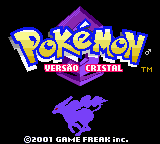
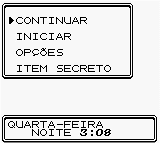
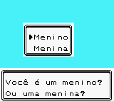
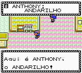
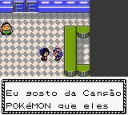

# Pokémon - Crystal Version

## Informações sobre o jogo

| Tipo | Informação |
| ----------- | ----------- |
| Nome | Pokémon \- Crystal Version |
| Plataforma | [Game Boy Color](../) |
| Desenvolvedora | Game Freak |
| Distribuidora | Nintendo |
| Gênero | RPG |
| Data de Lançamento | 29/07/2001 |

## Informações sobre a tradução

| Tipo | Informação |
| ----------- | ----------- |
| Versão | 1\.2 |
| Última versão | Sim |
| Observação | No Pokémon Cristal, você poderá jogar com um menino ou com uma menina\. Porém, no inglês, os adjetivos na maioria dos casos não concordam em gênero com o substantivo, o contrário da língua portuguesa\. Se você escolher jogar com uma menina, vai se deparar com frases do tipo: &quot;Fulana foi presenteado\.\.\.&quot;, que constitui um erro de concordância nominal\. Mas foi mantido o padrão masculino propositalmente, por questões estéticas e de tempo\. |
| Data de Lançamento | 03/04/2005 |
| Percentual traduzido | 100% |

## Autores

| Autor(a) | Papel na tradução |
| ----------- | ----------- |
| [R\_Lopes](../../../autores/r_lopes/) | Completo |
| [Fserve](../../../autores/fserve/) | Revisão |

## Grupos

* [Tradu\-Roms](../../../grupos/tradu-roms/)

## Informações sobre patching

| Formato do patch | Aplicar o patch no arquivo | CRC32 Hash | MD5 Hash |
| ----------- | ----------- | ----------- | ----------- |
| IPS | Pokemon \- Crystal Version \(UE\) \(V1\.1\) \[C\]\[\!\]\.gbc | 3358E30A | 301899B8087289A6436B0A241FBBB474 |

## Páginas sobre a tradução

| URL | Oficial (publicado pelos autores) | Possuí link de download |
| ----------- | ----------- | ----------- |
| [https://traduroms.github.io/tr/tradus/pkcry.htm](https://traduroms.github.io/tr/tradus/pkcry.htm) | Sim | Sim |
| [https://www.zophar.net/translations/gameboy/brazilian-portuguese/pok-mon-crystal-version.html](https://www.zophar.net/translations/gameboy/brazilian-portuguese/pok-mon-crystal-version.html) | Não | Sim |
| [https://romhackers.org/traducoes/portatil/game-boy-color/pokemon-crystal-version-tradu-roms/](https://romhackers.org/traducoes/portatil/game-boy-color/pokemon-crystal-version-tradu-roms/) | Não | Não |

## Imagens da tradução

