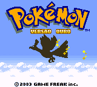
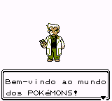
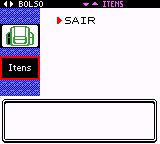

# Pokémon - Gold Version

## Informações sobre o jogo

| Tipo | Informação |
| ----------- | ----------- |
| Nome | Pokémon \- Gold Version |
| Plataforma | [Game Boy Color](../) |
| Desenvolvedora | Game Freak |
| Distribuidora | Nintendo |
| Gênero | RPG |
| Data de Lançamento | 14/10/2000 |

## Informações sobre a tradução

| Tipo | Informação |
| ----------- | ----------- |
| Versão | 1\.2 |
| Última versão | Sim |
| Data de Lançamento | 12/06/2006 |
| Percentual traduzido | 99% |

## Autores

| Autor(a) | Papel na tradução |
| ----------- | ----------- |
| [R\_Lopes](../../../autores/r_lopes/) | Completo |
| [Night\_Shadown](../../../autores/night_shadown/) | Completo |

## Grupos

* [Tradu\-Roms](../../../grupos/tradu-roms/)

## Informações sobre patching

| Aplicar o patch no arquivo | CRC32 Hash | MD5 Hash |
| ----------- | ----------- | ----------- |
| Pokemon \- Gold Version \(UE\) \[C\]\[\!\]\.gbc | 6BDE3C3E | A6924CE1F9AD2228E1C6580779B23878 |

## Páginas sobre a tradução

| URL | Oficial (publicado pelos autores) | Possuí link de download |
| ----------- | ----------- | ----------- |
| [https://traduroms.github.io/tr/gbc.htm](https://traduroms.github.io/tr/gbc.htm) | Sim | Sim |
| [https://www.zophar.net/translations/gameboy/brazilian-portuguese/pok-mon-gold-version.html](https://www.zophar.net/translations/gameboy/brazilian-portuguese/pok-mon-gold-version.html) | Não | Sim |
| [https://romhackers.org/traducoes/portatil/game-boy-color/pokemon-gold-version-r_lopes-e-night_shadown-tradu-roms/](https://romhackers.org/traducoes/portatil/game-boy-color/pokemon-gold-version-r_lopes-e-night_shadown-tradu-roms/) | Não | Não |

## Imagens da tradução

