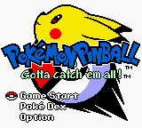
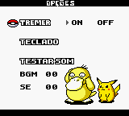
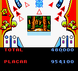

# Pokémon Pinball

## Informações sobre o jogo

| Tipo | Informação |
| ----------- | ----------- |
| Nome | Pokémon Pinball |
| Plataforma | [Game Boy Color](../) |
| Desenvolvedora | Jupiter |
| Distribuidora | Nintendo |
| Gênero | Pinball |
| Data de Lançamento | 28/06/1999 |

## Informações sobre a tradução

| Tipo | Informação |
| ----------- | ----------- |
| Última versão | Sim |
| Data de Lançamento | 21/12/2000 |
| Percentual traduzido | 90% |

## Autores

| Autor(a) | Papel na tradução |
| ----------- | ----------- |
| [Raph\_friend](../../../autores/raph_friend/) | Completo |
| [Night\_Shadown](../../../autores/night_shadown/) | Completo |

## Grupos

* [Tradu\-Roms](../../../grupos/tradu-roms/)

## Informações sobre patching

| Formato do patch | Aplicar o patch no arquivo | CRC32 Hash | MD5 Hash |
| ----------- | ----------- | ----------- | ----------- |
| IPS | Pokemon Pinball \(U\) \[C\]\[\!\]\.gbc | 03CE8D9A | FBE20570C2E52C937A9395024069BA3C |

## Páginas sobre a tradução

| URL | Oficial (publicado pelos autores) | Possuí link de download |
| ----------- | ----------- | ----------- |
| [https://www.zophar.net/translations/gameboy/portuguese/pokemon-pinball.html](https://www.zophar.net/translations/gameboy/portuguese/pokemon-pinball.html) | Não | Sim |
| [https://romhackers.org/traducoes/portatil/game-boy-color/pokemon-pinball-tradu-roms/](https://romhackers.org/traducoes/portatil/game-boy-color/pokemon-pinball-tradu-roms/) | Não | Não |

## Imagens da tradução

