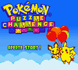
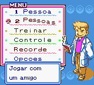
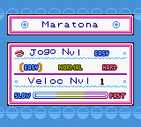

# Pokémon Puzzle Challenge

## Informações sobre o jogo

| Tipo | Informação |
| ----------- | ----------- |
| Nome | Pokémon Puzzle Challenge |
| Plataforma | [Game Boy Color](../) |
| Desenvolvedora | Intelligent Systems |
| Distribuidora | Nintendo |
| Gênero | Puzzle |
| Data de Lançamento | 01/09/2000 |

## Informações sobre a tradução

| Tipo | Informação |
| ----------- | ----------- |
| Última versão | Sim |
| Data de Lançamento | (Provavelmente) 13/01/2001 |
| Percentual traduzido | None% |

## Autores

| Autor(a) | Papel na tradução |
| ----------- | ----------- |
| [Sergiomhouse](../../../autores/sergiomhouse/) | Completo |

## Grupos

* [Tradumix](../../../grupos/tradumix/)

## Informações sobre patching

| Aplicar o patch no arquivo | CRC32 Hash | MD5 Hash |
| ----------- | ----------- | ----------- |
| Pokemon Puzzle Challenge \(U\) \[C\]\[\!\]\.gbc | D06BBA96 | F9EC4CC3C9DF3887DC731CCF53663FFB |

## Páginas sobre a tradução

| URL | Oficial (publicado pelos autores) | Possuí link de download |
| ----------- | ----------- | ----------- |
| [https://www.zophar.net/translations/gameboy/brazilian-portuguese/pok-mon-puzzle-challenge.html](https://www.zophar.net/translations/gameboy/brazilian-portuguese/pok-mon-puzzle-challenge.html) | Não | Sim |
| [https://romhackers.org/traducoes/portatil/game-boy-color/pokemon-puzzle-challenge-tradumix/](https://romhackers.org/traducoes/portatil/game-boy-color/pokemon-puzzle-challenge-tradumix/) | Não | Não |

## Imagens da tradução

