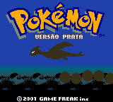
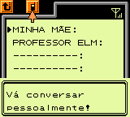
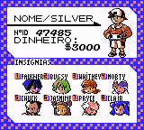

# Pokémon - Silver Version

## Informações sobre o jogo

| Tipo | Informação |
| ----------- | ----------- |
| Nome | Pokémon \- Silver Version |
| Plataforma | [Game Boy Color](../) |
| Desenvolvedora | Game Freak |
| Distribuidora | Nintendo |
| Gênero | RPG / Turno |
| Data de Lançamento | 14/10/2000 |

## Informações sobre a tradução

| Tipo | Informação |
| ----------- | ----------- |
| Versão | 1\.4 |
| Última versão | Sim |
| Data de Lançamento | 27/12/2001 |
| Percentual traduzido | 100% |

## Autores

| Autor(a) | Papel na tradução |
| ----------- | ----------- |
| [R\_Lopes](../../../autores/r_lopes/) | Completo |
| [Night\_Shadown](../../../autores/night_shadown/) | Tradução |
| [Fserve](../../../autores/fserve/) | Revisão |

## Grupos

* [Tradu\-Roms](../../../grupos/tradu-roms/)

## Informações sobre patching

| Aplicar o patch no arquivo | CRC32 Hash | MD5 Hash |
| ----------- | ----------- | ----------- |
| Pokemon \- Silver Version \(UE\) \[C\]\[\!\]\.gbc | 8AD48636 | 2AC166169354E84D0E2D7CF4CB40B312 |

## Páginas sobre a tradução

| URL | Oficial (publicado pelos autores) | Possuí link de download |
| ----------- | ----------- | ----------- |
| [https://traduroms.github.io/tr/tradus/pksil.htm](https://traduroms.github.io/tr/tradus/pksil.htm) | Sim | Sim |
| [https://www.zophar.net/translations/gameboy/portuguese/pokemon-silver.html](https://www.zophar.net/translations/gameboy/portuguese/pokemon-silver.html) | Não | Sim |
| [https://www.romhacking.net/translations/1938/](https://www.romhacking.net/translations/1938/) | Não | Sim |
| [https://romhackers.org/traducoes/portatil/game-boy-color/pokemon-silver-version-tradu-roms/](https://romhackers.org/traducoes/portatil/game-boy-color/pokemon-silver-version-tradu-roms/) | Não | Não |

## Imagens da tradução

