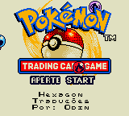
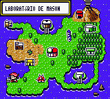
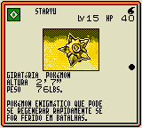

# Pokémon Trading Card Game

## Informações sobre o jogo

| Tipo | Informação |
| ----------- | ----------- |
| Nome | Pokémon Trading Card Game |
| Plataforma | [Game Boy Color](../) |
| Desenvolvedora | Hudson |
| Distribuidora | Nintendo |
| Gênero | TCG |
| Data de Lançamento | 31/03/2000 |

## Informações sobre a tradução

| Tipo | Informação |
| ----------- | ----------- |
| Versão | 1\.1 |
| Última versão | Sim |
| Data de Lançamento | 11/06/2001 |
| Percentual traduzido | 100% |

## Autores

| Autor(a) | Papel na tradução |
| ----------- | ----------- |
| [Odin](../../../autores/odin/) | Completo |
| [GreenGoblin](../../../autores/greengoblin/) | Gráficos |

## Grupos

* [Hexagon](../../../grupos/hexagon/)

## Informações sobre patching

| Formato do patch | Aplicar o patch no arquivo | CRC32 Hash | MD5 Hash |
| ----------- | ----------- | ----------- | ----------- |
| IPS e IPS\-EXE | Pokemon Trading Card Game \(U\) \[C\]\[\!\]\.gbc | 81069D53 | 219B2CC64E5A052003015D4BD4C622CD |

## Páginas sobre a tradução

| URL | Oficial (publicado pelos autores) | Possuí link de download |
| ----------- | ----------- | ----------- |
| [https://www.zophar.net/translations/gameboy/portuguese/pokemon-trading-card-game.html](https://www.zophar.net/translations/gameboy/portuguese/pokemon-trading-card-game.html) | Não | Sim |
| [https://romhackers.org/traducoes/portatil/game-boy-color/pokemon-trading-card-game-hexagon/](https://romhackers.org/traducoes/portatil/game-boy-color/pokemon-trading-card-game-hexagon/) | Não | Não |

## Imagens da tradução

