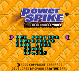
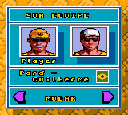
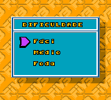

# Power Spike - Pro Beach Volleyball

## Informações sobre o jogo

| Tipo | Informação |
| ----------- | ----------- |
| Nome | Power Spike \- Pro Beach Volleyball |
| Plataforma | [Game Boy Color](../) |
| Desenvolvedora | Spark Creative SARL |
| Distribuidora | Infogrames |
| Gênero | Esportes |
| Data de Lançamento | 22/12/2000 |

## Informações sobre a tradução

| Tipo | Informação |
| ----------- | ----------- |
| Última versão | Sim |
| Data de Lançamento | (Provavelmente) 08/05/2001 |
| Percentual traduzido | 100% |

## Autores

| Autor(a) | Papel na tradução |
| ----------- | ----------- |
| [Dark\_Blade](../../../autores/dark_blade/) | Completo |

## Grupos

* [Evil Darkness](../../../grupos/evil-darkness/)

## Informações sobre patching

| Aplicar o patch no arquivo | CRC32 Hash | MD5 Hash |
| ----------- | ----------- | ----------- |
| Power Spike \- Pro Beach Volleyball \(U\) \[C\]\[\!\]\.gbc | AE57D1C3 | AFD9281EAC1EACD73C200CBC69F57B9E |

## Páginas sobre a tradução

| URL | Oficial (publicado pelos autores) | Possuí link de download |
| ----------- | ----------- | ----------- |
| [https://www.zophar.net/translations/gameboy/brazilian-portuguese/power-spike-pro-beach-volleyball.html](https://www.zophar.net/translations/gameboy/brazilian-portuguese/power-spike-pro-beach-volleyball.html) | Não | Sim |
| [https://romhackers.org/traducoes/portatil/game-boy-color/power-spike-pro-beach-volleyball-evil-darkness/](https://romhackers.org/traducoes/portatil/game-boy-color/power-spike-pro-beach-volleyball-evil-darkness/) | Não | Não |

## Imagens da tradução

