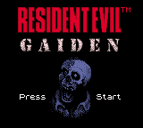
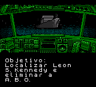
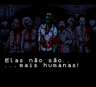

# Resident Evil Gaiden

## Informações sobre o jogo

| Tipo | Informação |
| ----------- | ----------- |
| Nome | Resident Evil Gaiden |
| Plataforma | [Game Boy Color](../) |
| Desenvolvedora | Capcom |
| Distribuidora | Capcom |
| Gênero | Survival Horror |
| Data de Lançamento | 14/12/2001 |

## Informações sobre a tradução

| Tipo | Informação |
| ----------- | ----------- |
| Última versão | Sim |
| Data de Lançamento | 28/01/2002 |
| Percentual traduzido | 100% |

## Autores

| Autor(a) | Papel na tradução |
| ----------- | ----------- |
| [Griever](../../../autores/griever/) | Completo |

## Grupos

* [Tramulação\-Traduções](../../../grupos/tramulacao-traducoes/)

## Informações sobre patching

| Aplicar o patch no arquivo | CRC32 Hash | MD5 Hash |
| ----------- | ----------- | ----------- |
| Resident Evil Gaiden \(E\) \(M5\) \[C\]\[\!\]\.gbc | F85C3F2C | 8A7F483857E251D56A16594CA84D1A7E |

## Páginas sobre a tradução

| URL | Oficial (publicado pelos autores) | Possuí link de download |
| ----------- | ----------- | ----------- |
| [https://www.zophar.net/translations/gameboy/portuguese/resident-evil-gaiden.html](https://www.zophar.net/translations/gameboy/portuguese/resident-evil-gaiden.html) | Não | Sim |
| [https://romhackers.org/traducoes/portatil/game-boy-color/resident-evil-gaiden-tramulacao/](https://romhackers.org/traducoes/portatil/game-boy-color/resident-evil-gaiden-tramulacao/) | Não | Não |

## Imagens da tradução

