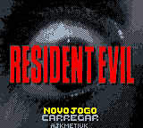
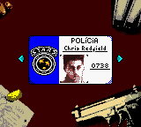
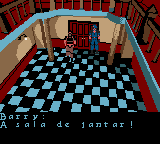
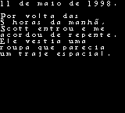

# Resident Evil (Prototype)

## Informações sobre o jogo

| Tipo | Informação |
| ----------- | ----------- |
| Nome | Resident Evil \(Prototype\) |
| Plataforma | [Game Boy Color](../) |
| Desenvolvedora | HotGen Studios |
| Distribuidora | (Sem distribuição) |
| Gênero | Survival Horror |
| Data de Lançamento | (Por volta de) ??/??/2000 |
| Descrição | Esta é uma adaptação para o Game Boy Color do jogo original para PlayStation, que foi anunciada ao mesmo tempo da versão para Nintendo 64 de Resident Evil 0, com novos inimigos e formas de save a serem incluídos\.
Embora a HotGen Studios, desenvolvedora da adaptação, ser capaz de recriar o estilo tridimensional do jogo original no hardware do Game Boy Color através de um processo de compressão de imagens, o projeto foi cancelado\.
Assim que a HotGen Studios e a Capcom perceberam que o jogo seria de tão baixa qualidade para produzir, um título reserva, Resident Evil Gaiden, foi criado levando\-se em conta os limites do Game Boy Color\.
A única chance que os fãs da série tiveram de ter acesso ao título foi através de duas roms as quais vazaram na internet\.
O cartucho 1 possui o jogo 90% completo, já o cartucho 2 é o mais incompleto e só há possibilidade de jogar com um personagem\. |

## Informações sobre a tradução

| Tipo | Informação |
| ----------- | ----------- |
| Versão | 1\.1 |
| Última versão | Sim |
| Observação | Originalmente esse jogo não tem como chegar ao final porque faltou programação, a sala &quot;existia&quot; mas não podia ser acessada\. 
Então o usuário PacoChan da cena romhacking internacional criou um patch que &quot;arruma&quot; esses problemas, possibilitando chegar até o Heliporto, que é a última tela do jogo, pegar o Sinalizador \(Flare\) e\.\.\. Fim\.\.\. 
Não tem finais programados, então o jogo acaba aí mesmo\. Eu fiz minha tradução com esse patch aplicado, então não precisa aplicar ele separado\. |
| Data de Lançamento | 21/11/2016 |
| Percentual traduzido | 100% |

## Autores

| Autor(a) | Papel na tradução |
| ----------- | ----------- |
| [ajkmetiuk](../../../autores/ajkmetiuk/) | Completo |

## Informações sobre patching

| Aplicar o patch no arquivo | CRC32 Hash | MD5 Hash |
| ----------- | ----------- | ----------- |
| Resident Evil GBC Cart 1\.gb | 53F7BBA1 | FD91D5D69C43F2F0406B3626D625B6E6 |

## Páginas sobre a tradução

| URL | Oficial (publicado pelos autores) | Possuí link de download |
| ----------- | ----------- | ----------- |
| [https://www.romhacking.net/translations/3522/](https://www.romhacking.net/translations/3522/) | Sim | Sim |
| [https://www.romhacking.net.br/index.php?topic=50](https://www.romhacking.net.br/index.php?topic=50) | Sim | Sim, porém é necessário realizar login |
| [https://www.zophar.net/translations/gameboy/brazilian-portuguese/resident-evil-prototype-.html](https://www.zophar.net/translations/gameboy/brazilian-portuguese/resident-evil-prototype-.html) | Não | Sim |
| [https://romhackers.org/traducoes/portatil/game-boy-color/resident-evil-gbc-cart-1-ajkmetiuk/](https://romhackers.org/traducoes/portatil/game-boy-color/resident-evil-gbc-cart-1-ajkmetiuk/) | Não | Não |

## Imagens da tradução

