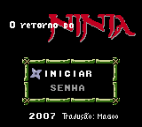
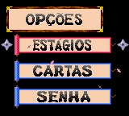
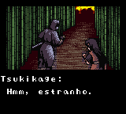

# Return of the Ninja

## Informações sobre o jogo

| Tipo | Informação |
| ----------- | ----------- |
| Nome | Return of the Ninja |
| Plataforma | [Game Boy Color](../) |
| Desenvolvedora | Natsume |
| Distribuidora | Natsume |
| Gênero | Stealth |
| Data de Lançamento | (Por volta de) ??/06/2001 |

## Informações sobre a tradução

| Tipo | Informação |
| ----------- | ----------- |
| Última versão | Sim |
| Data de Lançamento | 11/11/2007 |
| Percentual traduzido | 100% |

## Autores

| Autor(a) | Papel na tradução |
| ----------- | ----------- |
| [Mr\. Magoo](../../../autores/mr-magoo/) | Completo |
| [Balboa](../../../autores/balboa/) | Romhacking |

## Informações sobre patching

| Aplicar o patch no arquivo | CRC32 Hash | MD5 Hash |
| ----------- | ----------- | ----------- |
| Return of the Ninja \(U\) \[C\]\[\!\]\.gbc | A07DA702 | 178EA5A9EBA6E7F35E894BAD1EC34F77 |

## Páginas sobre a tradução

| URL | Oficial (publicado pelos autores) | Possuí link de download |
| ----------- | ----------- | ----------- |
| [https://www.zophar.net/translations/gameboy/brazilian-portuguese/return-of-the-ninja.html](https://www.zophar.net/translations/gameboy/brazilian-portuguese/return-of-the-ninja.html) | Não | Sim |
| [https://romhackers.org/traducoes/portatil/game-boy-color/return-of-the-ninja-mr.magoo-e-balboa/](https://romhackers.org/traducoes/portatil/game-boy-color/return-of-the-ninja-mr.magoo-e-balboa/) | Não | Não |

## Imagens da tradução

