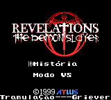
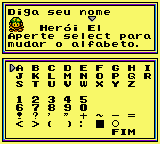
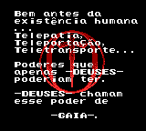

# Revelations - The Demon Slayer

## Informações sobre o jogo

| Tipo | Informação |
| ----------- | ----------- |
| Nome | Revelations \- The Demon Slayer |
| Plataforma | [Game Boy Color](../) |
| Desenvolvedora | Atlus |
| Distribuidora | Atlus |
| Gênero | RPG |
| Data de Lançamento | 27/08/1999 |

## Informações sobre a tradução

| Tipo | Informação |
| ----------- | ----------- |
| Última versão | Sim |
| Data de Lançamento | 05/05/2002 |
| Percentual traduzido | 100% |

## Autores

| Autor(a) | Papel na tradução |
| ----------- | ----------- |
| [Griever](../../../autores/griever/) | Completo |

## Grupos

* [Tramulação\-Traduções](../../../grupos/tramulacao-traducoes/)

## Informações sobre patching

| Formato do patch | Aplicar o patch no arquivo | CRC32 Hash | MD5 Hash |
| ----------- | ----------- | ----------- | ----------- |
| IPS | Revelations \- The Demon Slayer \(U\) \[C\]\[\!\]\.gbc | D1A65D74 | 86ED74283FE0071F8D3F05923051EFAB |

## Páginas sobre a tradução

| URL | Oficial (publicado pelos autores) | Possuí link de download |
| ----------- | ----------- | ----------- |
| [https://www.zophar.net/translations/gameboy/portuguese/revelations-the-demons-slayer.html](https://www.zophar.net/translations/gameboy/portuguese/revelations-the-demons-slayer.html) | Não | Sim |
| [https://www.romhacking.net/translations/1939/](https://www.romhacking.net/translations/1939/) | Não | Sim |
| [https://romhackers.org/traducoes/portatil/game-boy-color/revelations-the-demon-slayer-tramulacao/](https://romhackers.org/traducoes/portatil/game-boy-color/revelations-the-demon-slayer-tramulacao/) | Não | Não |

## Imagens da tradução

