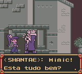

# Shantae

## Informações sobre o jogo

| Tipo | Informação |
| ----------- | ----------- |
| Nome | Shantae |
| Plataforma | [Game Boy Color](../) |
| Desenvolvedora | WayForward |
| Distribuidora | Capcom |
| Gênero | Ação / Plataforma |
| Data de Lançamento | 02/06/2002 |

## Informações sobre a tradução

| Tipo | Informação |
| ----------- | ----------- |
| Versão | 1\.1 |
| Última versão | Sim |
| Data de Lançamento | 19/12/2002 |
| Percentual traduzido | 100% |

## Autores

| Autor(a) | Papel na tradução |
| ----------- | ----------- |
| [Ifrit Ryudo](../../../autores/ifrit-ryudo/) | Completo |
| [SSJ Son Lucas](../../../autores/ssj-son-lucas/) | Completo |
| [Japa Boy Junior](../../../autores/japa-boy-junior/) | Completo |

## Grupos

* [Made In Brasil \(MIB\)](../../../grupos/made-in-brasil-mib/)

## Informações sobre patching

| Aplicar o patch no arquivo | CRC32 Hash | MD5 Hash |
| ----------- | ----------- | ----------- |
| Shantae \(U\) \[C\]\[\!\]\.gbc | E994B59B | 028C4262DBB49F4FC462A6EB3E514D72 |

## Páginas sobre a tradução

| URL | Oficial (publicado pelos autores) | Possuí link de download |
| ----------- | ----------- | ----------- |
| [https://www.zophar.net/translations/gameboy/brazilian-portuguese/shantae.html](https://www.zophar.net/translations/gameboy/brazilian-portuguese/shantae.html) | Não | Sim |
| [https://romhackers.org/traducoes/portatil/game-boy-color/shantae-made-in-brasil/](https://romhackers.org/traducoes/portatil/game-boy-color/shantae-made-in-brasil/) | Não | Não |

## Imagens da tradução

