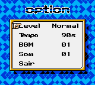
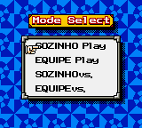
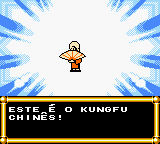

# Soul Falchion

## Informações sobre o jogo

| Tipo | Informação |
| ----------- | ----------- |
| Nome | Soul Falchion |
| Plataforma | [Game Boy Color](../) |
| Desenvolvedora | Li Cheng |
| Distribuidora | Li Cheng |
| Gênero | Luta |
| Data de Lançamento | (Por volta de) ??/??/2002 |

## Informações sobre a tradução

| Tipo | Informação |
| ----------- | ----------- |
| Versão | 1\.0 |
| Última versão | Sim |
| Data de Lançamento | 22/08/2021 |
| Percentual traduzido | None% |

## Autores

| Autor(a) | Papel na tradução |
| ----------- | ----------- |
| [Chatty](../../../autores/chatty/) | Completo |

## Informações sobre patching

| Aplicar o patch no arquivo | CRC32 Hash | MD5 Hash |
| ----------- | ----------- | ----------- |
| Soul Falchion \(Unl\) \[C\]\.gbc | 7AFAE089 | A173EB46EF11840B9318A8832828280B |

## Páginas sobre a tradução

| URL | Oficial (publicado pelos autores) | Possuí link de download |
| ----------- | ----------- | ----------- |
| [https://www.romhacking.net/translations/6239/](https://www.romhacking.net/translations/6239/) | Não | Sim |
| [https://www.zophar.net/translations/gameboy/portuguese.html](https://www.zophar.net/translations/gameboy/portuguese.html) | Não | Sim |

## Imagens da tradução

