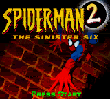

# Spider-Man 2 - The Sinister Six

## Informações sobre o jogo

| Tipo | Informação |
| ----------- | ----------- |
| Nome | Spider\-Man 2 \- The Sinister Six |
| Plataforma | [Game Boy Color](../) |
| Desenvolvedora | Torus Games |
| Distribuidora | Activision |
| Gênero | Ação / Plataforma |
| Data de Lançamento | 30/05/2001 |

## Informações sobre a tradução

| Tipo | Informação |
| ----------- | ----------- |
| Última versão | Sim |
| Data de Lançamento | (Provavelmente) 10/09/2002 |
| Percentual traduzido | 100% |

## Autores

| Autor(a) | Papel na tradução |
| ----------- | ----------- |
| [Lohan](../../../autores/lohan/) | Completo |

## Grupos

* [Evil Darkness](../../../grupos/evil-darkness/)

## Informações sobre patching

| Aplicar o patch no arquivo | CRC32 Hash | MD5 Hash |
| ----------- | ----------- | ----------- |
| Spider\-Man 2 \- The Sinister Six \(U\) \[C\]\[\!\]\.gbc | A7FAACCF | 85BBAD46380DFFA631F8CE732E9C5D89 |

## Páginas sobre a tradução

| URL | Oficial (publicado pelos autores) | Possuí link de download |
| ----------- | ----------- | ----------- |
| [https://www.zophar.net/translations/gameboy/brazilian-portuguese/spider-man-2-the-sinister-six.html](https://www.zophar.net/translations/gameboy/brazilian-portuguese/spider-man-2-the-sinister-six.html) | Não | Sim |
| [https://romhackers.org/traducoes/portatil/game-boy-color/spider-man-2-the-sinister-six-evil-darkness/](https://romhackers.org/traducoes/portatil/game-boy-color/spider-man-2-the-sinister-six-evil-darkness/) | Não | Não |

## Imagens da tradução

