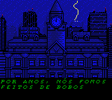
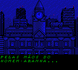
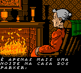
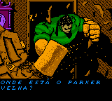

# Spider-Man 2 - The Sinister Six

## Informações sobre o jogo

| Tipo | Informação |
| ----------- | ----------- |
| Nome | Spider\-Man 2 \- The Sinister Six |
| Plataforma | [Game Boy Color](../) |
| Desenvolvedora | Torus Games |
| Distribuidora | Activision |
| Gênero | Ação / Plataforma |
| Data de Lançamento | 30/05/2001 |

## Informações sobre a tradução

| Tipo | Informação |
| ----------- | ----------- |
| Última versão | Sim |
| Data de Lançamento | 03/03/2002 |
| Percentual traduzido | 100% |

## Autores

| Autor(a) | Papel na tradução |
| ----------- | ----------- |
| [S\-NES](../../../autores/s-nes/) | Completo |

## Grupos

* [Tradu\-Roms](../../../grupos/tradu-roms/)

## Informações sobre patching

| Formato do patch | Aplicar o patch no arquivo | CRC32 Hash | MD5 Hash |
| ----------- | ----------- | ----------- | ----------- |
| IPS | Spider\-Man 2 \- The Sinister Six \(U\) \[C\]\[\!\]\.gbc | A7FAACCF | 85BBAD46380DFFA631F8CE732E9C5D89 |

## Páginas sobre a tradução

| URL | Oficial (publicado pelos autores) | Possuí link de download |
| ----------- | ----------- | ----------- |
| [https://traduroms.github.io/tr/tradus/spidegbc.htm](https://traduroms.github.io/tr/tradus/spidegbc.htm) | Sim | Sim |
| [https://www.zophar.net/translations/gameboy/portuguese/spider-man-2-the-sinister-six.html](https://www.zophar.net/translations/gameboy/portuguese/spider-man-2-the-sinister-six.html) | Não | Sim |
| [https://www.romhacking.net/translations/1942/](https://www.romhacking.net/translations/1942/) | Não | Sim |
| [https://romhackers.org/traducoes/portatil/game-boy-color/spider-man-2-the-sinister-six-tradu-roms/](https://romhackers.org/traducoes/portatil/game-boy-color/spider-man-2-the-sinister-six-tradu-roms/) | Não | Não |

## Imagens da tradução

