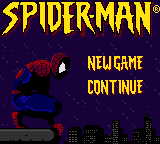
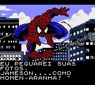
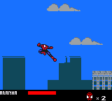

# Spider-Man

## Informações sobre o jogo

| Tipo | Informação |
| ----------- | ----------- |
| Nome | Spider\-Man |
| Plataforma | [Game Boy Color](../) |
| Desenvolvedora | Vicarious Visions |
| Distribuidora | Activision |
| Gênero | Ação / Plataforma |
| Data de Lançamento | 31/08/2000 |

## Informações sobre a tradução

| Tipo | Informação |
| ----------- | ----------- |
| Última versão | Sim |
| Data de Lançamento | (Provavelmente) 31/08/2001 |
| Percentual traduzido | 100% |

## Autores

| Autor(a) | Papel na tradução |
| ----------- | ----------- |
| [Dark\_Blade](../../../autores/dark_blade/) | Completo |

## Grupos

* [Evil Darkness](../../../grupos/evil-darkness/)

## Informações sobre patching

| Aplicar o patch no arquivo | CRC32 Hash | MD5 Hash |
| ----------- | ----------- | ----------- |
| Spider\-Man \(U\) \[C\]\[\!\]\.gbc | 34E2B3BA | 9FDE547BCB70B108895E259DA4C4E100 |

## Páginas sobre a tradução

| URL | Oficial (publicado pelos autores) | Possuí link de download |
| ----------- | ----------- | ----------- |
| [https://www.zophar.net/translations/gameboy/brazilian-portuguese/spider-man.html](https://www.zophar.net/translations/gameboy/brazilian-portuguese/spider-man.html) | Não | Sim |
| [https://romhackers.org/traducoes/portatil/game-boy-color/spider-man-evil-darkness/](https://romhackers.org/traducoes/portatil/game-boy-color/spider-man-evil-darkness/) | Não | Não |

## Imagens da tradução

