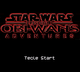
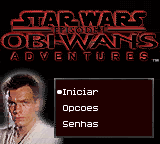
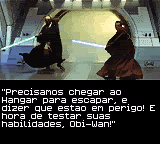

# Star Wars Episode I - Obi-Wan's Adventures

## Informações sobre o jogo

| Tipo | Informação |
| ----------- | ----------- |
| Nome | Star Wars Episode I \- Obi\-Wan's Adventures |
| Plataforma | [Game Boy Color](../) |
| Desenvolvedora | HotGen Studios |
| Distribuidora | THQ |
| Gênero | Ação |
| Data de Lançamento | 27/11/2000 |

## Informações sobre a tradução

| Tipo | Informação |
| ----------- | ----------- |
| Última versão | Sim |
| Data de Lançamento | (Provavelmente) 22/01/2002 |
| Percentual traduzido | 100% |

## Autores

| Autor(a) | Papel na tradução |
| ----------- | ----------- |
| [Dark\_Blade](../../../autores/dark_blade/) | Completo |

## Grupos

* [Evil Darkness](../../../grupos/evil-darkness/)

## Informações sobre patching

| Aplicar o patch no arquivo | CRC32 Hash | MD5 Hash |
| ----------- | ----------- | ----------- |
| Star Wars Episode I \- Obi\-Wan’s Adventures \(U\) \[C\]\[\!\]\.gbc | 0E697582 | 484EEB83AD00353272767485ECA59EA5 |

## Páginas sobre a tradução

| URL | Oficial (publicado pelos autores) | Possuí link de download |
| ----------- | ----------- | ----------- |
| [https://www.zophar.net/translations/gameboy/brazilian-portuguese/star-wars-episode-i-obi-wan-s-adventures.html](https://www.zophar.net/translations/gameboy/brazilian-portuguese/star-wars-episode-i-obi-wan-s-adventures.html) | Não | Sim |
| [https://romhackers.org/traducoes/portatil/game-boy-color/star-wars-episode-i-obi-wans-adventures-evil-darkness/](https://romhackers.org/traducoes/portatil/game-boy-color/star-wars-episode-i-obi-wans-adventures-evil-darkness/) | Não | Não |

## Imagens da tradução

