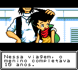
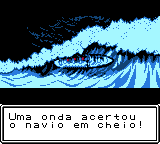
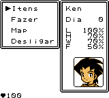
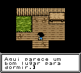
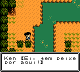
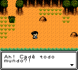

# Survival Kids

## Informações sobre o jogo

| Tipo | Informação |
| ----------- | ----------- |
| Nome | Survival Kids |
| Plataforma | [Game Boy Color](../) |
| Desenvolvedora | Konami |
| Distribuidora | Konami |
| Gênero | RPG / Ação |
| Data de Lançamento | 17/06/1999 |

## Informações sobre a tradução

| Tipo | Informação |
| ----------- | ----------- |
| Versão | 1\.1 |
| Última versão | Sim |
| Data de Lançamento | 19/03/2020 |
| Percentual traduzido | 99% |

## Autores

| Autor(a) | Papel na tradução |
| ----------- | ----------- |
| [LobisOne](../../../autores/lobisone/) | Completo |

## Informações sobre patching

| Formato do patch | Aplicar o patch no arquivo | CRC32 Hash | MD5 Hash |
| ----------- | ----------- | ----------- | ----------- |
| IPS | Survival Kids \(U\) \[C\]\[\!\]\.gbc | C46ABA56 | 07D4DF7A1C93F5BEF617E5A90B9EDEE2 |

## Páginas sobre a tradução

| URL | Oficial (publicado pelos autores) | Possuí link de download |
| ----------- | ----------- | ----------- |
| [https://www.romhacking.net.br/index.php?topic=1450](https://www.romhacking.net.br/index.php?topic=1450) | Sim | Sim |
| [https://www.romhacking.net/translations/5446/](https://www.romhacking.net/translations/5446/) | Sim | Sim |

## Imagens da tradução

