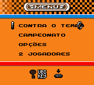

# Suzuki Alstare Extreme Racing

## Informações sobre o jogo

| Tipo | Informação |
| ----------- | ----------- |
| Nome | Suzuki Alstare Extreme Racing |
| Plataforma | [Game Boy Color](../) |
| Desenvolvedora | Visual Impact |
| Distribuidora | Ubisoft |
| Gênero | Corrida |
| Data de Lançamento | (Por volta de) ??/??/1999 |

## Informações sobre a tradução

| Tipo | Informação |
| ----------- | ----------- |
| Versão | 1\.0 |
| Última versão | Sim |
| Observação | A tradução foi feita no idioma english\. |
| Data de Lançamento | 31/12/2011 |
| Percentual traduzido | 99% |

## Autores

| Autor(a) | Papel na tradução |
| ----------- | ----------- |
| [Fael Morris](../../../autores/fael-morris/) | Completo |

## Grupos

* [Disco Voador Romhacking](../../../grupos/disco-voador-romhacking/)

## Informações sobre patching

| Aplicar o patch no arquivo | CRC32 Hash | MD5 Hash |
| ----------- | ----------- | ----------- |
| Suzuki Alstare Extreme Racing \(E\) \(M6\) \[C\]\[\!\]\.gbc | 0F7264BA | 54051BC19CE1C0301710D7845717DBAD |

## Páginas sobre a tradução

| URL | Oficial (publicado pelos autores) | Possuí link de download |
| ----------- | ----------- | ----------- |
| [https://www.zophar.net/translations/gameboy/brazilian-portuguese/suzuki-alstare-extreme-racing.html](https://www.zophar.net/translations/gameboy/brazilian-portuguese/suzuki-alstare-extreme-racing.html) | Não | Sim |
| [https://romhackers.org/traducoes/portatil/game-boy-color/suzuki-alstare-extreme-racing-disco-voador-romhacking/](https://romhackers.org/traducoes/portatil/game-boy-color/suzuki-alstare-extreme-racing-disco-voador-romhacking/) | Não | Não |

## Imagens da tradução

