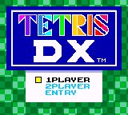
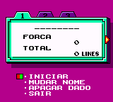
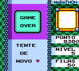

# Tetris DX

## Informações sobre o jogo

| Tipo | Informação |
| ----------- | ----------- |
| Nome | Tetris DX |
| Plataforma | [Game Boy Color](../) |
| Desenvolvedora | Nintendo |
| Distribuidora | Nintendo |
| Gênero | Puzzle |
| Data de Lançamento | 31/10/1998 |

## Informações sobre a tradução

| Tipo | Informação |
| ----------- | ----------- |
| Última versão | Sim |
| Data de Lançamento | 16/12/2000 |
| Percentual traduzido | 100% |

## Autores

| Autor(a) | Papel na tradução |
| ----------- | ----------- |
| [Raph\_friend](../../../autores/raph_friend/) | Completo |

## Grupos

* [Tradu\-Roms](../../../grupos/tradu-roms/)

## Informações sobre patching

| Aplicar o patch no arquivo | CRC32 Hash | MD5 Hash |
| ----------- | ----------- | ----------- |
| Tetris DX \(JU\) \[C\]\[\!\]\.gbc | 69989152 | 65973D7A1446346294F8CA9D2D1B7E66 |

## Páginas sobre a tradução

| URL | Oficial (publicado pelos autores) | Possuí link de download |
| ----------- | ----------- | ----------- |
| [https://www.zophar.net/translations/gameboy/brazilian-portuguese/tetris-dx.html](https://www.zophar.net/translations/gameboy/brazilian-portuguese/tetris-dx.html) | Não | Sim |
| [https://romhackers.org/traducoes/portatil/game-boy-color/tetris-dx-tradu-roms/](https://romhackers.org/traducoes/portatil/game-boy-color/tetris-dx-tradu-roms/) | Não | Não |

## Imagens da tradução

