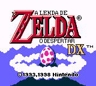
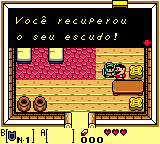
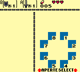

# The Legend of Zelda - Link's Awakening DX

## Informações sobre o jogo

| Tipo | Informação |
| ----------- | ----------- |
| Nome | The Legend of Zelda \- Link's Awakening DX |
| Plataforma | [Game Boy Color](../) |
| Desenvolvedora | Nintendo |
| Distribuidora | Nintendo |
| Gênero | RPG / Ação |
| Data de Lançamento | 31/10/1998 |

## Informações sobre a tradução

| Tipo | Informação |
| ----------- | ----------- |
| Versão | 1\.1 |
| Última versão | Sim |
| Data de Lançamento | 09/06/1999 |
| Percentual traduzido | 100% |

## Autores

| Autor(a) | Papel na tradução |
| ----------- | ----------- |
| [Zero](../../../autores/zero/) | Completo |

## Grupos

* [CBT](../../../grupos/cbt/)

## Informações sobre patching

| Aplicar o patch no arquivo | CRC32 Hash | MD5 Hash |
| ----------- | ----------- | ----------- |
| Legend of Zelda, The \- Link’s Awakening DX \(U\) \(V1\.0\) \[C\]\[\!\]\.gbc | 97822948 | 07C211479386825042EFB4AD31BB525F |

## Páginas sobre a tradução

| URL | Oficial (publicado pelos autores) | Possuí link de download |
| ----------- | ----------- | ----------- |
| [https://www.zophar.net/translations/gameboy/brazilian-portuguese/the-legend-of-zelda-link-s-awakening-dx.html](https://www.zophar.net/translations/gameboy/brazilian-portuguese/the-legend-of-zelda-link-s-awakening-dx.html) | Não | Sim |
| [https://romhackers.org/traducoes/portatil/game-boy-color/the-legend-of-zelda-links-awakening-dx-cbt/](https://romhackers.org/traducoes/portatil/game-boy-color/the-legend-of-zelda-links-awakening-dx-cbt/) | Não | Não |

## Imagens da tradução

