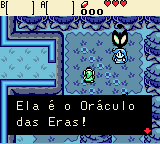
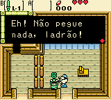

# The Legend of Zelda - Oracle of Ages

## Informações sobre o jogo

| Tipo | Informação |
| ----------- | ----------- |
| Nome | The Legend of Zelda \- Oracle of Ages |
| Plataforma | [Game Boy Color](../) |
| Desenvolvedora | Capcom |
| Distribuidora | Nintendo |
| Gênero | RPG / Ação |
| Data de Lançamento | 05/10/2001 |

## Informações sobre a tradução

| Tipo | Informação |
| ----------- | ----------- |
| Versão | Final |
| Última versão | Sim |
| Observação | No Menu de Escolha de Idiomas, escolha o idioma &quot;Español&quot;, para jogar em português\. |
| Data de Lançamento | 18/07/2011 |
| Percentual traduzido | 90% |

## Autores

| Autor(a) | Papel na tradução |
| ----------- | ----------- |
| [Luccasdavid](../../../autores/luccasdavid/) | Completo |

## Grupos

* [Disco Voador Romhacking](../../../grupos/disco-voador-romhacking/)

## Informações sobre patching

| Aplicar o patch no arquivo | CRC32 Hash | MD5 Hash |
| ----------- | ----------- | ----------- |
| Legend of Zelda, The \- Oracle of Ages \(E\) \(M5\) \[C\]\[\!\]\.gbc | 5933E3FA | 825DE040EA4DFF66661693F8712B1BDB |

## Páginas sobre a tradução

| URL | Oficial (publicado pelos autores) | Possuí link de download |
| ----------- | ----------- | ----------- |
| [https://disco-voador-romhack.blogspot.com/2011/07/traducao-do-oracle-of-ages-finalmente.html](https://disco-voador-romhack.blogspot.com/2011/07/traducao-do-oracle-of-ages-finalmente.html) | Sim | Sim, porém estão inativos |
| [https://www.zophar.net/translations/gameboy/brazilian-portuguese/the-legend-of-zelda-oracle-of-ages.html](https://www.zophar.net/translations/gameboy/brazilian-portuguese/the-legend-of-zelda-oracle-of-ages.html) | Não | Sim |
| [https://romhackers.org/traducoes/portatil/game-boy-color/the-legend-of-zelda-oracle-of-ages-disco-voador-romhacking/](https://romhackers.org/traducoes/portatil/game-boy-color/the-legend-of-zelda-oracle-of-ages-disco-voador-romhacking/) | Não | Não |

## Imagens da tradução

