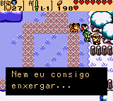
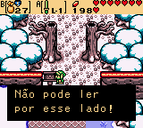
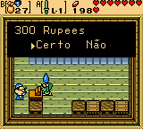
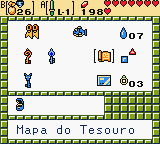
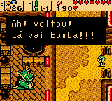

# The Legend of Zelda - Oracle Of Seasons

## Informações sobre o jogo

| Tipo | Informação |
| ----------- | ----------- |
| Nome | The Legend of Zelda \- Oracle Of Seasons |
| Plataforma | [Game Boy Color](../) |
| Desenvolvedora | Capcom |
| Distribuidora | Nintendo |
| Gênero | RPG / Ação |
| Data de Lançamento | 05/10/2001 |

## Informações sobre a tradução

| Tipo | Informação |
| ----------- | ----------- |
| Última versão | Sim |
| Data de Lançamento | 15/06/2005 |
| Percentual traduzido | 100% |

## Autores

| Autor(a) | Papel na tradução |
| ----------- | ----------- |
| [R\_Lopes](../../../autores/r_lopes/) | Completo |
| [Fserve](../../../autores/fserve/) | Revisão |

## Grupos

* [Tradu\-Roms](../../../grupos/tradu-roms/)

## Informações sobre patching

| Aplicar o patch no arquivo | CRC32 Hash | MD5 Hash |
| ----------- | ----------- | ----------- |
| Legend of Zelda, The \- Oracle of Seasons \(E\) \(M5\) \[C\]\[\!\]\.gbc | DBAC1357 | 4CA44CBDD4E05C9B3C22DA96D3DE6338 |

## Páginas sobre a tradução

| URL | Oficial (publicado pelos autores) | Possuí link de download |
| ----------- | ----------- | ----------- |
| [https://traduroms.github.io/tr/tradus/zelsea.htm](https://traduroms.github.io/tr/tradus/zelsea.htm) | Sim | Sim |
| [https://www.zophar.net/translations/gameboy/brazilian-portuguese/the-legend-of-zelda-oracle-of-seasons.html](https://www.zophar.net/translations/gameboy/brazilian-portuguese/the-legend-of-zelda-oracle-of-seasons.html) | Não | Sim |
| [https://romhackers.org/traducoes/portatil/game-boy-color/the-legend-of-zelda-oracle-of-seasons-tradu-roms/](https://romhackers.org/traducoes/portatil/game-boy-color/the-legend-of-zelda-oracle-of-seasons-tradu-roms/) | Não | Não |

## Imagens da tradução

