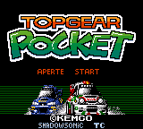
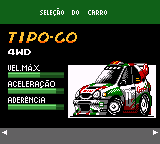
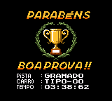

# Top Gear Pocket

## Informações sobre o jogo

| Tipo | Informação |
| ----------- | ----------- |
| Nome | Top Gear Pocket |
| Plataforma | [Game Boy Color](../) |
| Desenvolvedora | Kemco |
| Distribuidora | Vision Works |
| Gênero | Corrida |
| Data de Lançamento | 31/03/1999 |

## Informações sobre a tradução

| Tipo | Informação |
| ----------- | ----------- |
| Versão | 1\.0 |
| Última versão | Sim |
| Data de Lançamento | 13/07/2003 |
| Percentual traduzido | 100% |

## Autores

| Autor(a) | Papel na tradução |
| ----------- | ----------- |
| [ShadowSonic](../../../autores/shadowsonic/) | Completo |

## Grupos

* [Trans\-Center](../../../grupos/trans-center/)

## Informações sobre patching

| Aplicar o patch no arquivo | CRC32 Hash | MD5 Hash |
| ----------- | ----------- | ----------- |
| Top Gear Pocket \(U\) \[C\]\[\!\]\.gbc | 84499FC1 | 809251D6205BC712211FBCAB55190A3A |

## Páginas sobre a tradução

| URL | Oficial (publicado pelos autores) | Possuí link de download |
| ----------- | ----------- | ----------- |
| [https://www.zophar.net/translations/gameboy/brazilian-portuguese/top-gear-pocket.html](https://www.zophar.net/translations/gameboy/brazilian-portuguese/top-gear-pocket.html) | Não | Sim |
| [https://romhackers.org/traducoes/portatil/game-boy-color/top-gear-pocket-trans-center/](https://romhackers.org/traducoes/portatil/game-boy-color/top-gear-pocket-trans-center/) | Não | Não |

## Imagens da tradução

