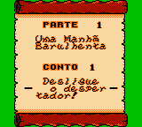
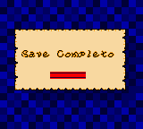
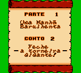

# Wario Land II

## Informações sobre o jogo

| Tipo | Informação |
| ----------- | ----------- |
| Nome | Wario Land II |
| Plataforma | [Game Boy Color](../) |
| Desenvolvedora | Nintendo |
| Distribuidora | Nintendo |
| Gênero | Ação / Plataforma |
| Data de Lançamento | (Por volta de) ??/??/1999 |

## Informações sobre a tradução

| Tipo | Informação |
| ----------- | ----------- |
| Versão | 1\.0 |
| Última versão | Sim |
| Data de Lançamento | 16/01/2009 |
| Percentual traduzido | 90% |

## Autores

| Autor(a) | Papel na tradução |
| ----------- | ----------- |
| [Balboa](../../../autores/balboa/) | Completo |

## Informações sobre patching

| Aplicar o patch no arquivo | CRC32 Hash | MD5 Hash |
| ----------- | ----------- | ----------- |
| Wario Land II \(U\) \[C\]\[\!\]\.gbc | 047BDF80 | B7598A51E0ACC0D74CA8F464826371ED |

## Páginas sobre a tradução

| URL | Oficial (publicado pelos autores) | Possuí link de download |
| ----------- | ----------- | ----------- |
| [https://www.zophar.net/translations/gameboy/brazilian-portuguese/wario-land-ii.html](https://www.zophar.net/translations/gameboy/brazilian-portuguese/wario-land-ii.html) | Não | Sim |
| [https://romhackers.org/traducoes/portatil/game-boy-color/wario-land-ii-balboa/](https://romhackers.org/traducoes/portatil/game-boy-color/wario-land-ii-balboa/) | Não | Não |

## Imagens da tradução

