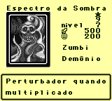
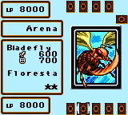
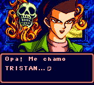
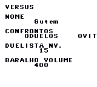
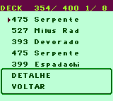

# Yu-Gi-Oh! Dark Duel Stories

## Informações sobre o jogo

| Tipo | Informação |
| ----------- | ----------- |
| Nome | Yu\-Gi\-Oh\! Dark Duel Stories |
| Plataforma | [Game Boy Color](../) |
| Desenvolvedora | Konami |
| Distribuidora | Konami |
| Gênero | TCG |
| Data de Lançamento | 18/03/2002 |

## Informações sobre a tradução

| Tipo | Informação |
| ----------- | ----------- |
| Versão | 1\.0 |
| Última versão | Sim |
| Data de Lançamento | 13/05/2019 |
| Percentual traduzido | 99% |

## Autores

| Autor(a) | Papel na tradução |
| ----------- | ----------- |
| [Gutembergh A\.](../../../autores/gutembergh-a/) | Completo |
| [Redarts](../../../autores/redarts/) | Completo |

## Informações sobre patching

| Formato do patch | Aplicar o patch no arquivo | CRC32 Hash | MD5 Hash |
| ----------- | ----------- | ----------- | ----------- |
| IPS | Yu\-Gi\-Oh\! Dark Duel Stories \(U\) \[C\]\[\!\]\.gbc | 803A56AE | C30ADD585D87114288FF8E3726C5381B |

## Páginas sobre a tradução

| URL | Oficial (publicado pelos autores) | Possuí link de download |
| ----------- | ----------- | ----------- |
| [https://www.romhacking.net.br/index.php?topic=1180](https://www.romhacking.net.br/index.php?topic=1180) | Sim | Sim |
| [https://joao13traducoes.com/2019/06/gbc-yu-gi-oh-dark-duel-stories-gutembergh-alencar-e-redarts/](https://joao13traducoes.com/2019/06/gbc-yu-gi-oh-dark-duel-stories-gutembergh-alencar-e-redarts/) | Não | Sim, porém o arquivo ou página de download exige uma senha |

## Imagens da tradução

