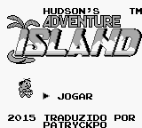
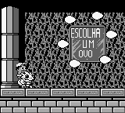

# Adventure Island

## Informações sobre o jogo

| Tipo | Informação |
| ----------- | ----------- |
| Nome | Adventure Island |
| Plataforma | [Game Boy](../) |
| Desenvolvedora | Hudson |
| Distribuidora | Hudson |
| Gênero | Ação / Plataforma |
| Data de Lançamento | (Por volta de) ??/??/1991 |
| Descrição | Este jogo é baseado no Adventure Island 2, do NES\. Nesse jogo você controla Higgins em sua busca pela Tina, irmã\(?\) da princesa Leilani, em 8 ilhas de perigo e aventura\. |

## Informações sobre a tradução

| Tipo | Informação |
| ----------- | ----------- |
| Versão | 1\.2 |
| Última versão | Sim |
| Data de Lançamento | 10/07/2018 |
| Percentual traduzido | 100% |

## Autores

| Autor(a) | Papel na tradução |
| ----------- | ----------- |
| [patryckpo](../../../autores/patryckpo/) | Tradução |
| [ajkmetiuk](../../../autores/ajkmetiuk/) | Revisão |

## Informações sobre patching

| Formato do patch | Aplicar o patch no arquivo | CRC32 Hash | MD5 Hash |
| ----------- | ----------- | ----------- | ----------- |
| IPS | Adventure Island \(U\)\.gb | 64F4FA44 | D67E58BF5F39D5FB073FED85C3D9BEDE |

## Páginas sobre a tradução

| URL | Oficial (publicado pelos autores) | Possuí link de download |
| ----------- | ----------- | ----------- |
| [https://patryckpo.com/traducoes/gb/adventure-island/](https://patryckpo.com/traducoes/gb/adventure-island/) | Sim | Sim |
| [https://www.romhacking.net.br/index.php?topic=754](https://www.romhacking.net.br/index.php?topic=754) | Sim | Sim, porém é necessário realizar login |
| [https://romhackers.org/traducoes/portatil/game-boy/adventure-island-patryck/](https://romhackers.org/traducoes/portatil/game-boy/adventure-island-patryck/) | Não | Não |

## Imagens da tradução

