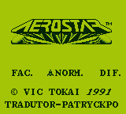
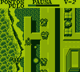

# Aerostar

## Informações sobre o jogo

| Tipo | Informação |
| ----------- | ----------- |
| Nome | Aerostar |
| Plataforma | [Game Boy](../) |
| Desenvolvedora | Vic Tokai |
| Distribuidora | Sunsoft |
| Gênero | Shoot 'em up |
| Data de Lançamento | (Por volta de) ??/09/1991 |
| Descrição | Após o fim da Sexta Guerra Mundial, a Terra ficou inóspita e inabitável pela humanidade\. Muitos anos depois o Conselho Intergalático determinou que a Terra poderia ser mais uma vez usada por humanos e enviou pessoas para restaurar a civilização lá\. Enquanto isso, os mutantes têm prosperado nas terras terrestres e não estavam dispostos a permitir que os humanos a repopulassem\. O Conselho Intergalático enviou um lutador solitário chamado Aerostar para defender a Terra de um segundo ato de destruição total\. |

## Informações sobre a tradução

| Tipo | Informação |
| ----------- | ----------- |
| Versão | 1\.1 |
| Última versão | Sim |
| Data de Lançamento | 22/01/2016 |
| Percentual traduzido | 95% |

## Autores

| Autor(a) | Papel na tradução |
| ----------- | ----------- |
| [patryckpo](../../../autores/patryckpo/) | Tradução |
| [ajkmetiuk](../../../autores/ajkmetiuk/) | Revisão |

## Informações sobre patching

| Formato do patch | Aplicar o patch no arquivo | CRC32 Hash | MD5 Hash |
| ----------- | ----------- | ----------- | ----------- |
| IPS | Aero Star \(U\) \[\!\]\.gb | F6FD275E | F777A4526089A83CA758EFBF01007EC1 |

## Páginas sobre a tradução

| URL | Oficial (publicado pelos autores) | Possuí link de download |
| ----------- | ----------- | ----------- |
| [https://patryckpo.com/traducoes/gb/aerostar/](https://patryckpo.com/traducoes/gb/aerostar/) | Sim | Sim |
| [https://romhackers.org/traducoes/portatil/game-boy/aerostar-patryck/](https://romhackers.org/traducoes/portatil/game-boy/aerostar-patryck/) | Não | Não |

## Imagens da tradução

