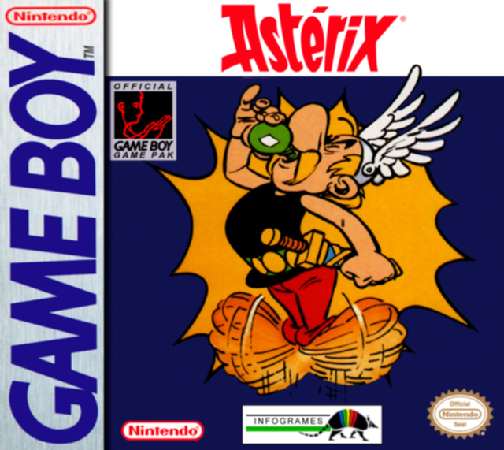
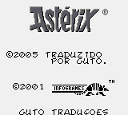
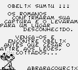
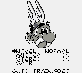
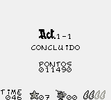
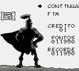

# Asterix

## Informações sobre o jogo

| Tipo | Informação |
| ----------- | ----------- |
| Nome | Asterix |
| Plataforma | [Game Boy](../) |
| Desenvolvedora | Infogrames |
| Distribuidora | Infogrames |
| Gênero | Ação / Plataforma |
| Data de Lançamento | (Por volta de) ??/??/1993 |

## Informações sobre a tradução

| Tipo | Informação |
| ----------- | ----------- |
| Última versão | Sim |
| Data de Lançamento | (Provavelmente) 30/03/2005 |
| Percentual traduzido | 100% |

## Autores

| Autor(a) | Papel na tradução |
| ----------- | ----------- |
| [Guto](../../../autores/guto/) | Completo |

## Informações sobre patching

| Aplicar o patch no arquivo | CRC32 Hash | MD5 Hash |
| ----------- | ----------- | ----------- |
| Asterix \(UE\) \(M5\) \[\!\]\.gb | 097FFE2C | 812DB832566202610BB1E42E643E2B93 |

## Páginas sobre a tradução

| URL | Oficial (publicado pelos autores) | Possuí link de download |
| ----------- | ----------- | ----------- |
| [https://www.romhacking.net/translations/1854/](https://www.romhacking.net/translations/1854/) | Não | Sim |
| [https://www.zophar.net/translations/gameboy/brazilian-portuguese/asterix.html](https://www.zophar.net/translations/gameboy/brazilian-portuguese/asterix.html) | Não | Sim |
| [https://romhackers.org/traducoes/portatil/game-boy/asterix-guto-traducoes/](https://romhackers.org/traducoes/portatil/game-boy/asterix-guto-traducoes/) | Não | Não |

## Imagens da tradução

