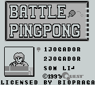
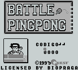
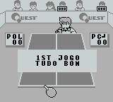

# Battle Pingpong

## Informações sobre o jogo

| Tipo | Informação |
| ----------- | ----------- |
| Nome | Battle Pingpong |
| Plataforma | [Game Boy](../) |
| Desenvolvedora | Quest |
| Distribuidora | Quest |
| Gênero | Esportes |
| Data de Lançamento | 31/08/1990 |

## Informações sobre a tradução

| Tipo | Informação |
| ----------- | ----------- |
| Última versão | Sim |
| Data de Lançamento | 19/02/2000 |
| Percentual traduzido | None% |

## Autores

| Autor(a) | Papel na tradução |
| ----------- | ----------- |
| [BioPraga](../../../autores/biopraga/) | Completo |

## Grupos

* [BRGames](../../../grupos/brgames/)

## Informações sobre patching

| Formato do patch | Aplicar o patch no arquivo | CRC32 Hash | MD5 Hash |
| ----------- | ----------- | ----------- | ----------- |
| IPS | Battle Pingpong \(J\)\.gb | 7C787BC4 | F24CCB89C3FF60F54600D7B063D5A6C2 |

## Páginas sobre a tradução

| URL | Oficial (publicado pelos autores) | Possuí link de download |
| ----------- | ----------- | ----------- |
| [https://www.romhacking.net/translations/1874/](https://www.romhacking.net/translations/1874/) | Não | Sim |
| [https://www.zophar.net/translations/gameboy/brazilian-portuguese/battle-pingpong.html](https://www.zophar.net/translations/gameboy/brazilian-portuguese/battle-pingpong.html) | Não | Sim |
| [https://romhackers.org/traducoes/portatil/game-boy/battle-pingpong-br-games/](https://romhackers.org/traducoes/portatil/game-boy/battle-pingpong-br-games/) | Não | Não |

## Imagens da tradução

