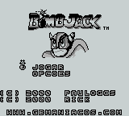
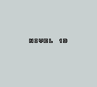
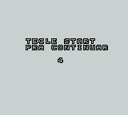

# Bomb Jack

## Informações sobre o jogo

| Tipo | Informação |
| ----------- | ----------- |
| Nome | Bomb Jack |
| Plataforma | [Game Boy](../) |
| Desenvolvedora | Tecmo (Tehkan LTDA) |
| Distribuidora | Infogrames |
| Gênero | Ação / Plataforma |
| Data de Lançamento | ??/??/1992 |

## Informações sobre a tradução

| Tipo | Informação |
| ----------- | ----------- |
| Última versão | Sim |
| Data de Lançamento | (Provavelmente) 07/11/2000 |
| Percentual traduzido | 100% |

## Autores

| Autor(a) | Papel na tradução |
| ----------- | ----------- |
| [Paulo GCS](../../../autores/paulo-gcs/) | Completo |
| [Rick](../../../autores/rick/) | Completo |

## Grupos

* [GB Maníacos](../../../grupos/gb-maniacos/)

## Informações sobre patching

| Aplicar o patch no arquivo | CRC32 Hash | MD5 Hash |
| ----------- | ----------- | ----------- |
| Bomb Jack \(U\)\.gb | 9BD8815E | 7615154DC9AFB1A7D7D2FE63B76C68E4 |

## Páginas sobre a tradução

| URL | Oficial (publicado pelos autores) | Possuí link de download |
| ----------- | ----------- | ----------- |
| [https://www.romhacking.net/translations/1873/](https://www.romhacking.net/translations/1873/) | Não | Sim |
| [https://www.zophar.net/translations/gameboy/brazilian-portuguese/bomb-jack.html](https://www.zophar.net/translations/gameboy/brazilian-portuguese/bomb-jack.html) | Não | Sim |
| [https://romhackers.org/traducoes/portatil/game-boy/bomb-jack-gb-maniacos/](https://romhackers.org/traducoes/portatil/game-boy/bomb-jack-gb-maniacos/) | Não | Não |

## Imagens da tradução

