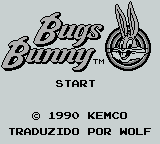
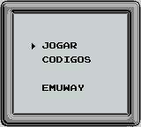
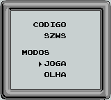

# Bugs Bunny

## Informações sobre o jogo

| Tipo | Informação |
| ----------- | ----------- |
| Nome | Bugs Bunny |
| Plataforma | [Game Boy](../) |
| Desenvolvedora | Kemco |
| Distribuidora | Kemco |
| Gênero | Ação / Plataforma |
| Data de Lançamento | 05/09/1989 |

## Informações sobre a tradução

| Tipo | Informação |
| ----------- | ----------- |
| Versão | 1\.0 |
| Última versão | Sim |
| Observação | Vale lembrar que a única diferença entre as duas traduções é o nome da BR Games que aparece no patch mais recente\. |
| Data de Lançamento | (Por volta de) ??/??/2000 |
| Percentual traduzido | 100% |

## Autores

| Autor(a) | Papel na tradução |
| ----------- | ----------- |
| [Wolf](../../../autores/wolf/) | Completo |

## Grupos

* [Emuway](../../../grupos/emuway/)

## Informações sobre patching

| Formato do patch | Aplicar o patch no arquivo | CRC32 Hash | MD5 Hash |
| ----------- | ----------- | ----------- | ----------- |
| IPS | Bugs Bunny \(U\) \[\!\]\.gb | 403E1B7E | 43189B859C0036119F233D46B1F2E9FD |

## Páginas sobre a tradução

| URL | Oficial (publicado pelos autores) | Possuí link de download |
| ----------- | ----------- | ----------- |
| [https://www.romhacking.net/translations/1897/](https://www.romhacking.net/translations/1897/) | Não | Sim |
| [https://romhackers.org/traducoes/portatil/game-boy/bugs-bunny-emuway/](https://romhackers.org/traducoes/portatil/game-boy/bugs-bunny-emuway/) | Não | Sim |
| [https://www.zophar.net/translations/gameboy/brazilian-portuguese/bugs-bunny.html](https://www.zophar.net/translations/gameboy/brazilian-portuguese/bugs-bunny.html) | Não | Sim |

## Imagens da tradução

