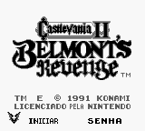
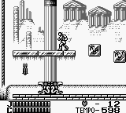

# Castlevania II - Belmont's Revenge

## Informações sobre o jogo

| Tipo | Informação |
| ----------- | ----------- |
| Nome | Castlevania II \- Belmont's Revenge |
| Plataforma | [Game Boy](../) |
| Desenvolvedora | Konami |
| Distribuidora | Konami |
| Gênero | Ação / Plataforma |
| Data de Lançamento | (Por volta de) ??/??/1991 |

## Informações sobre a tradução

| Tipo | Informação |
| ----------- | ----------- |
| Versão | 1\.0 |
| Última versão | Não |
| Observação | Vale destacar que o tradutor Gano lançou uma versão 1\.2 desta tradução pelo grupo Monkey’s Traduções\. Esta nova versão traz a tela de título e as palavras REST e SCORE traduzidas\. |
| Data de Lançamento | 07/09/2008 |
| Percentual traduzido | None% |

## Autores

| Autor(a) | Papel na tradução |
| ----------- | ----------- |
| [GANO](../../../autores/gano/) | Completo |

## Informações sobre patching

| Aplicar o patch no arquivo | CRC32 Hash | MD5 Hash |
| ----------- | ----------- | ----------- |
| Castlevania II \- Belmont's Revenge \(U\) \[\!\]\.gb | 8875C8FE | 7C65E9DA405D2225D079F75E56276822 |

## Páginas sobre a tradução

| URL | Oficial (publicado pelos autores) | Possuí link de download |
| ----------- | ----------- | ----------- |
| [https://romhackers.org/traducoes/portatil/game-boy/castlevania-ii-belmonts-revenge-gano/](https://romhackers.org/traducoes/portatil/game-boy/castlevania-ii-belmonts-revenge-gano/) | Não | Não |
| [https://www.zophar.net/translations/gameboy/brazilian-portuguese/castlevania-ii-belmont-s-revenge.html](https://www.zophar.net/translations/gameboy/brazilian-portuguese/castlevania-ii-belmont-s-revenge.html) | Não | Sim, porém é uma versão antiga |

## Imagens da tradução

