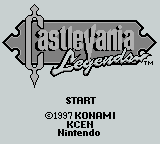
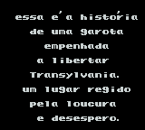
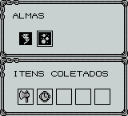

# Castlevania Legends

## Informações sobre o jogo

| Tipo | Informação |
| ----------- | ----------- |
| Nome | Castlevania Legends |
| Plataforma | [Game Boy](../) |
| Desenvolvedora | Konami |
| Distribuidora | Konami |
| Gênero | Ação / Plataforma |
| Data de Lançamento | 30/11/1997 |

## Informações sobre a tradução

| Tipo | Informação |
| ----------- | ----------- |
| Última versão | Sim |
| Data de Lançamento | 30/10/2007 |
| Percentual traduzido | 100% |

## Autores

| Autor(a) | Papel na tradução |
| ----------- | ----------- |
| [Mr\. Magoo](../../../autores/mr-magoo/) | Completo |

## Informações sobre patching

| Aplicar o patch no arquivo | CRC32 Hash | MD5 Hash |
| ----------- | ----------- | ----------- |
| Castlevania \- Legends \(U\) \[S\]\.gb | AD9C17FB | 1475824E7262C0D6359F43C287E034A5 |

## Páginas sobre a tradução

| URL | Oficial (publicado pelos autores) | Possuí link de download |
| ----------- | ----------- | ----------- |
| [https://www.zophar.net/translations/gameboy/brazilian-portuguese/castlevania-legends.html](https://www.zophar.net/translations/gameboy/brazilian-portuguese/castlevania-legends.html) | Não | Sim |
| [https://romhackers.org/traducoes/portatil/game-boy/castlevania-legends-mr.magoo/](https://romhackers.org/traducoes/portatil/game-boy/castlevania-legends-mr.magoo/) | Não | Não |

## Imagens da tradução

