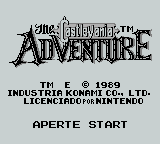
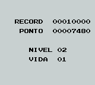
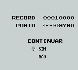

# Castlevania - The Adventure

## Informações sobre o jogo

| Tipo | Informação |
| ----------- | ----------- |
| Nome | Castlevania \- The Adventure |
| Plataforma | [Game Boy](../) |
| Desenvolvedora | Konami |
| Distribuidora | Konami |
| Gênero | Ação / Plataforma |
| Data de Lançamento | (Por volta de) ??/??/1989 |
| Descrição | Drácula desperta de seu sono centenário, com a certeza de que seu plano funcionou e que não há mais que temer a família Belmont\. Ele estava enganado\. Christopher Belmont o prova isto\. Durante a batalha com Christopher, Drácula sente que o melhor a fazer é fugir\. Ele não teve chances contra o Belmont, então decidiu esperar uma nova oportunidade para atacar, que ocorre quinze anos após o combate\. \(retirado da Wikipedia\) |

## Informações sobre a tradução

| Tipo | Informação |
| ----------- | ----------- |
| Versão | 1\.0 |
| Última versão | Sim |
| Observação | Eu joguei a tradução do começo ao fim no VisualBoyAdvance e não encontrei nenhum problema\. Também testei a tradução no Gest e no KiGB, mas não joguei até o fim e não sei se poderá dar algum problema neste ou em outros emuladores\.
Caso você encontre algum erro ou bug, queira me informar pelo meu e\-mail\. |
| Data de Lançamento | 07/09/2008 |
| Percentual traduzido | None% |

## Autores

| Autor(a) | Papel na tradução |
| ----------- | ----------- |
| [GANO](../../../autores/gano/) | Completo |

## Informações sobre patching

| Aplicar o patch no arquivo | CRC32 Hash | MD5 Hash |
| ----------- | ----------- | ----------- |
| Castlevania Adventure, The \(U\) \[\!\]\.gb | 216E6AA1 | 0B4410C6B94D6359DBA5609AE9A32909 |

## Páginas sobre a tradução

| URL | Oficial (publicado pelos autores) | Possuí link de download |
| ----------- | ----------- | ----------- |
| [https://www.zophar.net/translations/gameboy/brazilian-portuguese/castlevania-the-adventure.html](https://www.zophar.net/translations/gameboy/brazilian-portuguese/castlevania-the-adventure.html) | Não | Sim |
| [https://romhackers.org/traducoes/portatil/game-boy/castlevania-the-adventure-gano/](https://romhackers.org/traducoes/portatil/game-boy/castlevania-the-adventure-gano/) | Não | Não |

## Imagens da tradução

