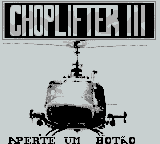
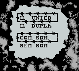
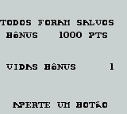

# Choplifter III

## Informações sobre o jogo

| Tipo | Informação |
| ----------- | ----------- |
| Nome | Choplifter III |
| Plataforma | [Game Boy](../) |
| Desenvolvedora | Teeny Weeny Games |
| Distribuidora | Ocean |
| Gênero | Ação |
| Data de Lançamento | (Por volta de) ??/??/1994 |

## Informações sobre a tradução

| Tipo | Informação |
| ----------- | ----------- |
| Versão | 1\.0 |
| Última versão | Sim |
| Data de Lançamento | 06/06/2009 |
| Percentual traduzido | 90% |

## Autores

| Autor(a) | Papel na tradução |
| ----------- | ----------- |
| [Lobim](../../../autores/lobim/) | Completo |

## Grupos

* [Monkey's Traduções](../../../grupos/monkeys-traducoes/)

## Informações sobre patching

| Aplicar o patch no arquivo | CRC32 Hash | MD5 Hash |
| ----------- | ----------- | ----------- |
| Choplifter III \(UE\) \[\!\]\.gb | 1B3B46EF | 04A6E77D1FABCBE325882E4BD79D6D4B |

## Páginas sobre a tradução

| URL | Oficial (publicado pelos autores) | Possuí link de download |
| ----------- | ----------- | ----------- |
| [https://www.zophar.net/translations/gameboy/brazilian-portuguese/choplifter-iii.html](https://www.zophar.net/translations/gameboy/brazilian-portuguese/choplifter-iii.html) | Não | Sim |
| [https://romhackers.org/traducoes/portatil/game-boy/choplifter-iii-monkeys-traducoes/](https://romhackers.org/traducoes/portatil/game-boy/choplifter-iii-monkeys-traducoes/) | Não | Não |

## Imagens da tradução

