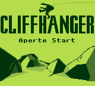
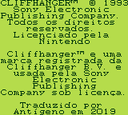
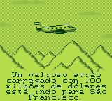
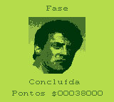
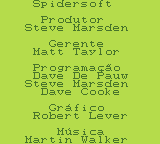
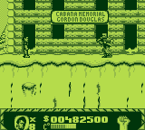

# Cliffhanger

## Informações sobre o jogo

| Tipo | Informação |
| ----------- | ----------- |
| Nome | Cliffhanger |
| Plataforma | [Game Boy](../) |
| Desenvolvedora | Spidersoft |
| Distribuidora | Sony |
| Gênero | Ação / Plataforma |
| Data de Lançamento | (Por volta de) ??/12/1993 |

## Informações sobre a tradução

| Tipo | Informação |
| ----------- | ----------- |
| Versão | 1\.07 |
| Última versão | Sim |
| Data de Lançamento | 17/11/2019 |
| Percentual traduzido | 100% |

## Autores

| Autor(a) | Papel na tradução |
| ----------- | ----------- |
| [Antígeno](../../../autores/antigeno/) | Completo |

## Informações sobre patching

| Formato do patch | Aplicar o patch no arquivo | CRC32 Hash | MD5 Hash |
| ----------- | ----------- | ----------- | ----------- |
| IPS | Cliffhanger \(UE\) \[\!\]\.gb | AA133439 | B33D6F65F4A566D715CE480BFFD004AD |

## Páginas sobre a tradução

| URL | Oficial (publicado pelos autores) | Possuí link de download |
| ----------- | ----------- | ----------- |
| [https://www.romhacking.net.br/index.php?topic=1330](https://www.romhacking.net.br/index.php?topic=1330) | Sim | Sim, porém é necessário realizar login |
| [https://blogdoantigeno.wordpress.com/traducoes/](https://blogdoantigeno.wordpress.com/traducoes/) | Sim | Sim, porém é necessário realizar login |
| [https://joao13traducoes.com/2019/11/gb-cliffhanger-antigeno/](https://joao13traducoes.com/2019/11/gb-cliffhanger-antigeno/) | Não | Sim, porém o arquivo ou página de download exige uma senha |

## Imagens da tradução

