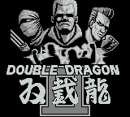
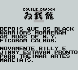
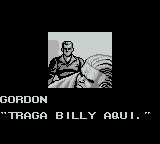

# Double Dragon 2

## Informações sobre o jogo

| Tipo | Informação |
| ----------- | ----------- |
| Nome | Double Dragon 2 |
| Plataforma | [Game Boy](../) |
| Desenvolvedora | Technos |
| Distribuidora | Acclaim |
| Gênero | Beat 'em up |
| Data de Lançamento | 07/12/1990 |

## Informações sobre a tradução

| Tipo | Informação |
| ----------- | ----------- |
| Última versão | Sim |
| Data de Lançamento | (Provavelmente) 16/06/2002 |
| Percentual traduzido | 100% |

## Autores

| Autor(a) | Papel na tradução |
| ----------- | ----------- |
| [Ericus\_Travis](../../../autores/ericus_travis/) | Completo |

## Grupos

* [Evil Darkness](../../../grupos/evil-darkness/)

## Informações sobre patching

| Formato do patch | Aplicar o patch no arquivo | CRC32 Hash | MD5 Hash |
| ----------- | ----------- | ----------- | ----------- |
| IPS | Double Dragon 2 \(U\)\.gb | 5B96E474 | 4F3B84EB325F9162086FAC77AC577E7C |

## Páginas sobre a tradução

| URL | Oficial (publicado pelos autores) | Possuí link de download |
| ----------- | ----------- | ----------- |
| [https://www.romhacking.net/translations/1898/](https://www.romhacking.net/translations/1898/) | Não | Sim |
| [https://www.zophar.net/translations/gameboy/brazilian-portuguese/double-dragon-2.html](https://www.zophar.net/translations/gameboy/brazilian-portuguese/double-dragon-2.html) | Não | Sim |
| [https://romhackers.org/traducoes/portatil/game-boy/double-dragon-ii-evil-darkness/](https://romhackers.org/traducoes/portatil/game-boy/double-dragon-ii-evil-darkness/) | Não | Não |

## Imagens da tradução

