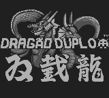

# Double Dragon

## Informações sobre o jogo

| Tipo | Informação |
| ----------- | ----------- |
| Nome | Double Dragon |
| Plataforma | [Game Boy](../) |
| Desenvolvedora | Technos |
| Distribuidora | Technos |
| Gênero | Beat 'em up |
| Data de Lançamento | (Por volta de) ??/08/1990 |

## Informações sobre a tradução

| Tipo | Informação |
| ----------- | ----------- |
| Versão | 1\.0 |
| Última versão | Sim |
| Data de Lançamento | 27/02/2011 |
| Percentual traduzido | 100% |

## Autores

| Autor(a) | Papel na tradução |
| ----------- | ----------- |
| [tvtoon](../../../autores/tvtoon/) | Completo |

## Grupos

* [PO\.B\.R\.E](../../../grupos/pobre/)

## Informações sobre patching

| Aplicar o patch no arquivo | CRC32 Hash | MD5 Hash |
| ----------- | ----------- | ----------- |
| Double Dragon \(U\) \[\!\]\.gb | 40A8BF12 | 545DE5C311259B7F7EC313A9D58CF4B4 |

## Páginas sobre a tradução

| URL | Oficial (publicado pelos autores) | Possuí link de download |
| ----------- | ----------- | ----------- |
| [https://romhackers.org/traducoes/portatil/game-boy/double-dragon-satira-po.b.r.e](https://romhackers.org/traducoes/portatil/game-boy/double-dragon-satira-po.b.r.e) | Sim | Não |
| [https://www.zophar.net/translations/gameboy/brazilian-portuguese/double-dragon.html](https://www.zophar.net/translations/gameboy/brazilian-portuguese/double-dragon.html) | Não | Sim |

## Imagens da tradução

