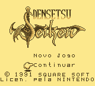
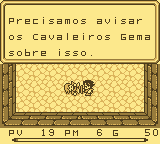
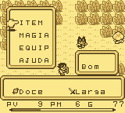
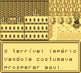
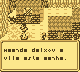

# Final Fantasy Adventure

## Informações sobre o jogo

| Tipo | Informação |
| ----------- | ----------- |
| Nome | Final Fantasy Adventure |
| Plataforma | [Game Boy](../) |
| Desenvolvedora | Squaresoft |
| Distribuidora | Squaresoft |
| Gênero | RPG / Turno |
| Data de Lançamento | 28/06/1991 |

## Informações sobre a tradução

| Tipo | Informação |
| ----------- | ----------- |
| Versão | 1\.1 |
| Última versão | Sim |
| Data de Lançamento | 19/10/2015 |
| Percentual traduzido | None% |

## Autores

| Autor(a) | Papel na tradução |
| ----------- | ----------- |
| [gotia2003](../../../autores/gotia2003/) | Completo |

## Informações sobre patching

| Aplicar o patch no arquivo | CRC32 Hash | MD5 Hash |
| ----------- | ----------- | ----------- |
| Final Fantasy Adventure \(U\)\.gb | 18C78B3A | 24CD3BDF490EF2E1AA6A8AF380ECCD78 |

## Páginas sobre a tradução

| URL | Oficial (publicado pelos autores) | Possuí link de download |
| ----------- | ----------- | ----------- |
| [https://www.romhacking.net/translations/2494/](https://www.romhacking.net/translations/2494/) | Não | Sim |
| [https://romhackers.org/traducoes/portatil/game-boy/final-fantasy-adventure-gotia2003/](https://romhackers.org/traducoes/portatil/game-boy/final-fantasy-adventure-gotia2003/) | Não | Não |
| [https://joao13traducoes.com/2021/11/gb-final-fantasy-adventure-gotia2003/](https://joao13traducoes.com/2021/11/gb-final-fantasy-adventure-gotia2003/) | Não | Sim, porém o arquivo ou página de download exige uma senha |

## Imagens da tradução

