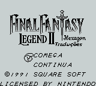
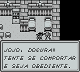
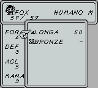

# Final Fantasy Legend II

## Informações sobre o jogo

| Tipo | Informação |
| ----------- | ----------- |
| Nome | Final Fantasy Legend II |
| Plataforma | [Game Boy](../) |
| Desenvolvedora | Squaresoft |
| Distribuidora | Squaresoft |
| Gênero | RPG |
| Data de Lançamento | 14/12/1990 |

## Informações sobre a tradução

| Tipo | Informação |
| ----------- | ----------- |
| Versão | 1\.0 |
| Última versão | Sim |
| Data de Lançamento | 18/03/2002 |
| Percentual traduzido | 100% |

## Autores

| Autor(a) | Papel na tradução |
| ----------- | ----------- |
| [GreenGoblin](../../../autores/greengoblin/) | Completo |

## Grupos

* [Hexagon](../../../grupos/hexagon/)

## Informações sobre patching

| Aplicar o patch no arquivo | CRC32 Hash | MD5 Hash |
| ----------- | ----------- | ----------- |
| Final Fantasy Legend II \(U\) \[\!\]\.gb | 58314182 | 2BB0DF1B672253AAA5F9CAF9AAB78224 |

## Páginas sobre a tradução

| URL | Oficial (publicado pelos autores) | Possuí link de download |
| ----------- | ----------- | ----------- |
| [https://www.romhacking.net/translations/1872/](https://www.romhacking.net/translations/1872/) | Não | Sim |
| [https://www.zophar.net/translations/gameboy/portuguese/final-fantasy-legend-ii.html](https://www.zophar.net/translations/gameboy/portuguese/final-fantasy-legend-ii.html) | Não | Sim |
| [https://romhackers.org/traducoes/portatil/game-boy/final-fantasy-legend-ii-hexagon/](https://romhackers.org/traducoes/portatil/game-boy/final-fantasy-legend-ii-hexagon/) | Não | Não |

## Imagens da tradução

