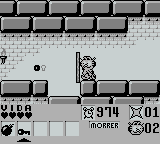

# Garfield Labyrinth

## Informações sobre o jogo

| Tipo | Informação |
| ----------- | ----------- |
| Nome | Garfield Labyrinth |
| Plataforma | [Game Boy](../) |
| Desenvolvedora | Kemco |
| Distribuidora | Kemco |
| Gênero | Ação / Plataforma |
| Data de Lançamento | (Por volta de) ??/??/1993 |

## Informações sobre a tradução

| Tipo | Informação |
| ----------- | ----------- |
| Última versão | Sim |
| Data de Lançamento | 29/12/2000 |
| Percentual traduzido | None% |

## Autores

| Autor(a) | Papel na tradução |
| ----------- | ----------- |
| [Paulo GCS](../../../autores/paulo-gcs/) | Completo |

## Grupos

* [GB Maníacos](../../../grupos/gb-maniacos/)

## Informações sobre patching

| Aplicar o patch no arquivo | CRC32 Hash | MD5 Hash |
| ----------- | ----------- | ----------- |
| Garfield Labyrinth \(U\)\.gb | 6A043ABD | 5E441AF514D1BCDAEC08C133CEEA4E5E |

## Páginas sobre a tradução

| URL | Oficial (publicado pelos autores) | Possuí link de download |
| ----------- | ----------- | ----------- |
| [https://www.zophar.net/translations/gameboy/brazilian-portuguese/garfield-labyrinth.html](https://www.zophar.net/translations/gameboy/brazilian-portuguese/garfield-labyrinth.html) | Não | Sim |
| [https://romhackers.org/traducoes/portatil/game-boy/garfield-labyrinth-gb-maniacos/](https://romhackers.org/traducoes/portatil/game-boy/garfield-labyrinth-gb-maniacos/) | Não | Não |

## Imagens da tradução

