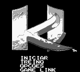
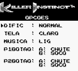
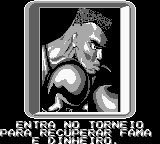

# Killer Instinct

## Informações sobre o jogo

| Tipo | Informação |
| ----------- | ----------- |
| Nome | Killer Instinct |
| Plataforma | [Game Boy](../) |
| Desenvolvedora | Rare |
| Distribuidora | Nintendo |
| Gênero | Luta |
| Data de Lançamento | (Por volta de) ??/11/1995 |

## Informações sobre a tradução

| Tipo | Informação |
| ----------- | ----------- |
| Última versão | Sim |
| Data de Lançamento | 21/07/2013 |
| Percentual traduzido | 70% |

## Autores

| Autor(a) | Papel na tradução |
| ----------- | ----------- |
| [Nolan](../../../autores/nolan/) | Completo |

## Informações sobre patching

| Aplicar o patch no arquivo | CRC32 Hash | MD5 Hash |
| ----------- | ----------- | ----------- |
| Killer Instinct \(U\) \[S\]\[\!\]\.gb | AC793B54 | BA8628A70339843C2EE8A294B840E8D6 |

## Páginas sobre a tradução

| URL | Oficial (publicado pelos autores) | Possuí link de download |
| ----------- | ----------- | ----------- |
| [https://www.zophar.net/translations/gameboy/brazilian-portuguese/killer-instinct.html](https://www.zophar.net/translations/gameboy/brazilian-portuguese/killer-instinct.html) | Não | Sim |
| [https://romhackers.org/traducoes/portatil/game-boy/killer-instinct-nolan/](https://romhackers.org/traducoes/portatil/game-boy/killer-instinct-nolan/) | Não | Não |

## Imagens da tradução

