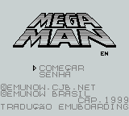
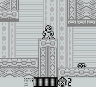
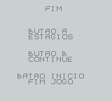

# Mega Man - Dr. Wily's Revenge

## Informações sobre o jogo

| Tipo | Informação |
| ----------- | ----------- |
| Nome | Mega Man \- Dr\. Wily's Revenge |
| Plataforma | [Game Boy](../) |
| Desenvolvedora | Capcom |
| Distribuidora | Capcom |
| Gênero | Run 'n gun |
| Data de Lançamento | 26/06/1991 |
| Descrição | Mega Man: Dr\. Wily’s Revenge is an action platformer game for the Nintendo Gameboy\. In Japan, the game was originally released under the title Rockman World\. |

## Informações sobre a tradução

| Tipo | Informação |
| ----------- | ----------- |
| Última versão | Sim |
| Data de Lançamento | (Provavelmente) 17/10/1999 |
| Percentual traduzido | None% |

## Autores

| Autor(a) | Papel na tradução |
| ----------- | ----------- |
| [Emuboarding](../../../autores/emuboarding/) | Completo |

## Grupos

* [EmuNow](../../../grupos/emunow/)

## Informações sobre patching

| Formato do patch | Aplicar o patch no arquivo | CRC32 Hash | MD5 Hash |
| ----------- | ----------- | ----------- | ----------- |
| IPS | Mega Man \- Dr\. Wily's Revenge \(U\) \[\!\]\.gb | 47E70E08 | 4BA4398181D98958FA7434BA7716F11A |

## Páginas sobre a tradução

| URL | Oficial (publicado pelos autores) | Possuí link de download |
| ----------- | ----------- | ----------- |
| [https://www.zophar.net/translations/gameboy/brazilian-portuguese/mega-man-dr-wily-s-revenge.html](https://www.zophar.net/translations/gameboy/brazilian-portuguese/mega-man-dr-wily-s-revenge.html) | Não | Sim |
| [https://romhackers.org/traducoes/portatil/game-boy/mega-man-dr.-wilys-revenge-emunow/](https://romhackers.org/traducoes/portatil/game-boy/mega-man-dr.-wilys-revenge-emunow/) | Não | Não |

## Imagens da tradução

